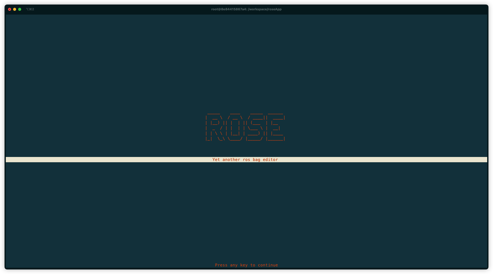
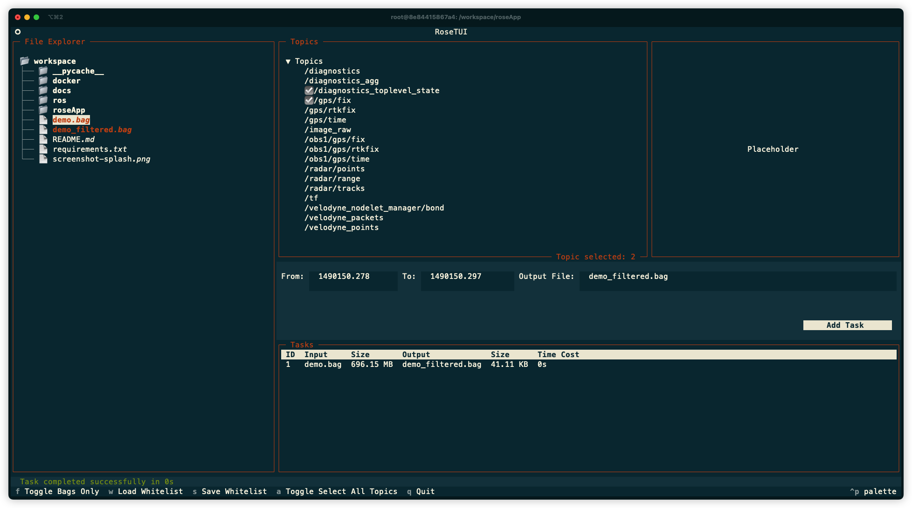

# ROS Bag Filter Tool

A high-performance ROS bag filtering tool  that allows you to extract specific topics from ROSv1 bag files. Built with C++ core and Python interface, it provides both command-line and TUI interfaces for efficient bag file processing.

>inspired by [rosbag_editor](https://github.com/klekkala/rosbag_editor)





## Key Features

- High-performance C++ processing core
  - [ ] make C++ interface asynchronous
- Interactive TUI for easy operation
- Command-line interface for automation
- Filter ROS bag files 
  - [X] with whitelists 
  - [X] with manually selected topics
  - [ ] by time range
- Docker support for cross-platform usage
- [ ] Batch processing in TUI

## Getting Started

### Prerequisites

Choose one of the following setup methods:

#### Option 1: Native Linux Installation
1. Install ROS Noetic (Ubuntu 20.04)
   ```bash
   # Follow ROS Noetic installation guide
   sudo apt install ros-noetic-desktop-full
   ```

2. Clone the repository
   ```bash
   git clone https://github.com/your-repo/rose.git
   cd rose
   ```

#### Option 2: Docker Installation
1. Build the Docker image:
   ```bash
   cd docker
   docker build -t rose .
   ```

2. Run the container:
   ```bash
   ./go_docker.sh
   ```

### Building and Setup

roseApp depends on rosbag_io_py lib and you need to build it first.

1. Build the ROS project:
   ```bash
   cd ros
   ./build_rosecode.sh
   ```

2. Set up environment which will make sure rosbag_io_py add to `PYTHONPATH`
   ```bash
   source setup.sh
   ```
  

## Usage

### Command Line Interface

1. Inspect bag file contents:
   ```bash
   ./rose.py inspect input.bag
   ```

2. Filter bag file with whitelist:
   ```bash
   ./rose.py filter input.bag output.bag --whitelist topics.txt
   ```

### TUI Interface



#### Usage
1. Launch the TUI:
   ```bash
   python3 rose.py tui
   ```

2. Key Bindings:
   - `q`: to quit
   - `f`: to filter bag files
   - `w`: to load whitelist
   - `s`: to save whitelist
   - `a`: to toggle select all topics

#### Whitelist Management

Create whitelist

1. Create topic whitelist from command line:
```bash
./rose.py inspect input.bag | awk '{print $1}' > whitelist/example.txt
```

2. Create topic whitelist with your favorite text editor and save it to `whitelist/` directory:

3. Create topic in TUI by press `s` to save current selected topics as whitelist file to `whitelist/` directory:


Configure whitelists in `config.json`:
```json
{
    "whitelists": {
        "example": "whitelist/example.txt"
    }
}
```

## Development

## Key Technologies

- **[Textual](https://textual.textualize.io/)**: A Python framework for building sophisticated TUI (Text User Interface) applications. Used for creating the interactive terminal interface.
- **[Click](https://click.palletsprojects.com/)**: A Python package for creating beautiful command line interfaces in a composable way. Used for building the CLI interface.
- **[Rich](https://rich.readthedocs.io/)**: A Python library for rich text and beautiful formatting in the terminal. Used for enhancing the visual presentation of both CLI and TUI.
- **[Pybind11](https://pybind11.readthedocs.io/)**: A lightweight header-only library that exposes C++ types in Python and vice versa. Used for wrapping ROS C++ interfaces to Python.


### Project Structure
```
project_root/
├── ros/            # ROS C++ core
│   ├── CMakeLists.txt
│   ├── devel/      # ros development folder
│   ├── build/      # build folder
│   ├── src/        # source code folder
|   ├── setup.sh    # setup script
|   └── build_rosecode.sh # build script
├── roseApp/        # Python application
│   ├── rose.py     # main script
│   ├── whitelists/ # topic whitelist folder
│   ├── config.json # config file
│   └── style.css   # style sheet
├── docker/              # Docker support
│   └── Dockerfile
│   └── go_docker.sh
├── docs/         # documentation
├── requirements.txt # dependencies
├── README.md     
```


## Resources

- Demo bag file: [webviz demo.bag](https://storage.googleapis.com/cruise-webviz-public/demo.bag)
- [ROS Noetic Installation](http://wiki.ros.org/noetic/Installation)


