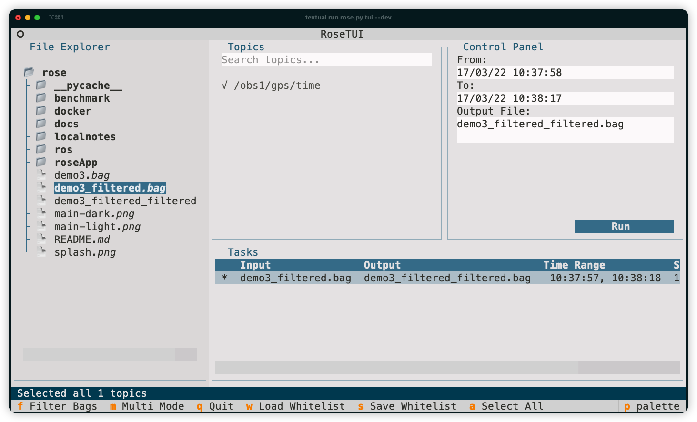
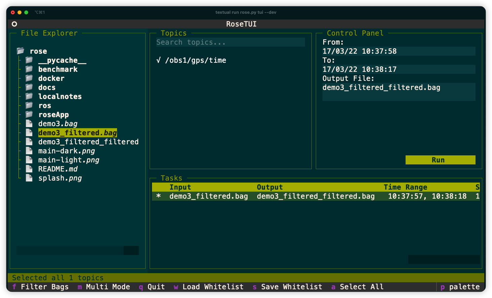

# ROSE - Yet Another ROS Bag Filter Tool

A high-performance ROS bag filtering tool that allows you to extract specific topics from ROSv1 bag files. Built with C++ core and Python interface, it provides both command-line and TUI interfaces for efficient bag file processing.


>inspired by [rosbag_editor](https://github.com/facontidavide/rosbag_editor)


## Aesthetic 

> The cassette tape, a modest analog artifact, has evolved into a retro-futurism icon, demonstrating that technological advancement can coexist with human touch. Its tactile interface and physical limitations serve as poignant reminders of our technological heritage.

> 磁带盒不仅是一种技术遗物，更是复古未来主义的艺术品和精神图腾。简单的按钮、褪色的塑料外壳和有限的存储容量，既是怀旧的载体，也是对数字霸权的温柔反抗。它时刻提醒着我们：技术的突飞猛进不应该以牺牲人性为代价，克制的设计往往更能打动人心。

The TUI embraces the **cassette futurism** aesthetic - a design philosophy that reimagines future interfaces through the lens of 20th century technological fossils. This intentional retrofuturism features:

- **Nostalgic minimalism**: Low-resolution displays and monochromatic schemes that evoke 1980s computing
- **Tactile authenticity**: Visual metaphors of physical media like magnetic tapes and CRT textures
- **Humanized technology**: Warm color palettes and "imperfect" interfaces that resist digital sterility

More than mere retro styling, this approach serves as poetic resistance to digital hegemony. The cassette tape - our central metaphor - embodies this duality: 


## Key Features and Todos

- 🎉 ROS Environment independent using [rosbags](https://pypi.org/project/rosbags/)
- 🌟 Interactive TUI for easy operation
- 🌟 Command-line interface for automation
- 🌟 Interactive CLI for guided operations
- Filter ROS bag files 
  - 🌟 with whitelists 
  - with manually selected topics
  - by time range (only TUI tested)
- 🌟 Fuzzy search topic in TUI
- 🌟 Multi-selection mode for batch processing in TUI (note:partially supported, rename and time range based filtering not supported yet) 
   - 🌟 parallel processing for Multi-selection mode
- Docker support for cross-platform usage
- 🌟 cassette futurism theme for dark and light mode
- 🚧 Message view in TUI
- 🚧 Support dynamic file/whitelist refresh in TUI

## Getting Started

### Installation

1. Install rose-bag from pypi
```bash
pip install rose-bag
```

2. Install from the source
```bash
# Clone the repository
git clone https://github.com/hanxiaomax/rose.git
cd rose

# Install dependencies
pip install -r requirements.txt
```

To uninstall Rose, run the following command:
```bash
pip uninstall rose-bag
```

### Terminal Setup

To ensure proper color display in your terminal, set the following environment variable:
```bash
# Add this to your bashrc or zshrc
export TERM=xterm-256color
```

No ROS bag file? No problem! Download [webviz demo.bag](https://storage.googleapis.com/cruise-webviz-public/demo.bag) and give it a try!

## Usage


### Command Line Interface

### Inline CLI

Rose provides a command-line tool for direct bag file operations. Currently, it supports the filter command:

```bash
# Basic usage
rose filter <input_bag> <output_bag> [OPTIONS]
```

**Parameters:**

- `<input_bag>`: Path to the input bag file (required)
- `<output_bag>`: Path to the output bag file (required)

**Options:**

- `-w, --whitelist TEXT`: Specify a topic whitelist file path
- `-t, --topics TEXT`: Specify topics to include, can be used multiple times to add multiple topics
- `-r, --time-range TEXT`: Specify time range in format "start_time,end_time", e.g., "23/01/01 00:00:00,23/01/01 00:10:00"
- `--dry-run`: Preview the operation without actually executing it
- `--help`: Show help information

**Usage Examples:**

1. Filter a bag file using a whitelist:
   ```bash
   rose filter input.bag output.bag -w whitelist.txt
   ```

2. Filter specific topics:
   ```bash
   rose filter input.bag output.bag -t /topic1 -t /topic2 -t /topic3
   ```

3. Preview filtering results without execution:
   ```bash
   rose filter input.bag output.bag -w whitelist.txt --dry-run
   ```

**Common Workflow Example:**

```bash
# 1. Create a whitelist containing GPS-related topics
mkdir -p whitelists
rose filter demo.bag --dry-run | grep "gps" > whitelists/gps_topics.txt

# 2. Filter the bag file using the whitelist
rose filter demo.bag gps_only.bag -w whitelists/gps_topics.txt
```

### Interactive CLI

For a guided experience with interactive prompts:

```bash
# Launch the interactive CLI tool
rose cli
```

The interactive CLI provides:
- Menu-driven interface for bag file operations
- Guided workflow for filtering and whitelist management
- Batch processing capabilities for multiple files
- Progress indicators and detailed results

Key features:
- Load single bag files or entire directories
- Select topics with fuzzy search
- Create, view, and manage whitelists
- Process multiple files in batch mode

#### Single Bag Processing


#### Multi-Bag Processing


### TUI Interface

> [!IMPORTANT]
> If you experience color display issues in your terminal, set the following environment variable:
> ```bash
> export TERM=xterm-256color
> ```
> This ensures proper color rendering in both CLI and TUI interfaces.

For a full-featured terminal user interface:

```bash
# Launch the TUI
rose tui
```


Key bindings:
- `q`: to quit
- `f`: to filter bag files
- `w`: to load whitelist
- `s`: to save whitelist
- `a`: to toggle select all topics

#### Configuration

Rose is configured with `roseApp/config.json`.
```json
{
    "show_splash_screen": true,
    "theme": "cassette-walkman",
    "whitelists": {
        "demo": "./whitelists/demo.txt",
        "radar": "./whitelists/radar.txt",
        "invalid": "./whitelists/invalid.txt"
    }
}
```

- `show_splash_screen`: whether to show the splash screen, default is true
- `theme`: the theme of the TUI, default is `cassette-walkman`, check [Theme](#theme) for more details
- `whitelists`: the whitelists of the TUI, default is empty, check [Whitelist](#whitelist) for more details

#### Theme
RoseApp TUI provides two built-in themes: `cassette-walkman` (default light theme) and `cassette-dark`. You can configure the theme in two ways:

| cassette-walkman | cassette-dark |
|------------|-------------|
|  |  |

1. Modify `config.json` to specify your preferred theme:

```json
{
    "theme": "cassette-dark",
}
```
2. Switch Theme in TUI with command palette(the buttom in bottom right corner or keybinding ^p)


### Whitelist

You can filter bag files with pre-configured whitelist. To select pre-configured whitelists, press `w` in TUI. But before that, you need to create your own whitelist.

You can create your own whitelist in 3 ways:

#### 1. Create topic whitelist with your favorite text editor and save it to `whitelist/`:


#### 2. Create whitelist with interactive cli and choose **2. whitelist**:
```bash
rose cli
```


#### 3. Create topic in TUI by press `s` to save current selected topics as whitelist file to `whitelist/` directory:

you can create/view/delete whitelists


After whitelist created, add it to `config.json` so RoseApp can find it:
```json
{
    "whitelists": {
        "demo": "./whitelists/demo.txt",
        "radar": "./whitelists/radar.txt",
        "invalid": "./whitelists/invalid.txt"
    }
}
```

## Development

### Run locally

```bash
python -m roseApp.rose --help
```

### Publishing to PyPI

To publish a new version to PyPI:

1. Update version in `pyproject.toml`
2. Install required tools:
```bash
pip install keyring keyrings.alt
```

3. Configure PyPI credentials:
```bash
# Using environment variables
export HATCH_INDEX_USER=__token__
export HATCH_INDEX_AUTH=your_pypi_token

# Or using hatch config
hatch config set pypi.auth.username __token__
hatch config set pypi.auth.password your_pypi_token
```

4. Build and publish:
```bash
# Build the package
hatch build

# Publish to PyPI
hatch publish
```

### Project Structure
```
project_root/
├── roseApp/        # Python application
│   ├── rose.py     # main script
│   ├── cli/        # CLI tools
│   │   ├── cli_tool.py  # Interactive CLI
│   │   ├── theme.py     # CLI theme configuration
│   │   └── util.py      # CLI utilities
│   ├── themes/     # TUI themes
│   ├── components/ # TUI components 
│   ├── core/       # Core functionality
│   │   ├── parser.py    # Bag file parser
│   │   └── util.py      # Utility functions
│   ├── tui.py      # TUI implementation
│   ├── whitelists/ # Topic whitelist folder
│   ├── config.json # Configuration file
│   └── style.tcss  # TUI style sheet
├── docker/         # Docker support
│   ├── Dockerfile
│   └── go_docker.sh
├── docs/           # Documentation
├── requirements.txt # Dependencies
└── README.md       # Project documentation
```

### Tech stack

- **[Textual](https://textual.textualize.io/)**: A Python framework for building sophisticated TUI applications. Used for creating the interactive terminal interface.
- **[Rich](https://rich.readthedocs.io/)**: A Python library for rich text and beautiful formatting in the terminal. Used for enhancing the visual presentation in both CLI and TUI.
- **[InquirerPy](https://github.com/kazhala/InquirerPy)**: A Python library for building interactive command line interfaces with elegant prompts. Used for the interactive CLI.
- **[Typer](https://typer.tiangolo.com/)**: A Python library for building CLI applications. Used for building the inline command-line interface.
- **[rosbags](https://pypi.org/project/rosbags/)**: A pure Python library for reading and writing ROS bag files. Used for ROS bag file processing without ROS dependencies.

### Rough ideas - data driven rendering


>[!TIP]
> Before you start with Textual, there are some docs worth reading:
>
> - [Textual devtools](https://textual.textualize.io/guide/devtools/) on how to use `textual run <your app> --dev` to go into dev mode and how to handle logs
> - [Design a layout](https://textual.textualize.io/how-to/design-a-layout/) 、[TextualCSS](https://textual.textualize.io/guide/CSS/) and [CSS Types](https://textual.textualize.io/css_types/) to understand how to design a layout and style your app with CSS. and more tips on [Styles](https://textual.textualize.io/guide/styles/) and its [reference](https://textual.textualize.io/styles/)
> - [Event and Messages](https://textual.textualize.io/guide/events/) are also important ideas to understand how Textual works so you can handle [actions](https://textual.textualize.io/guide/actions/)
> - Thanks to [Workers](https://textual.textualize.io/guide/workers/), asynchronous operations never been so easy. it can supppot asyncio or threads.

## Resources

- Demo bag file: [webviz demo.bag](https://storage.googleapis.com/cruise-webviz-public/demo.bag)


