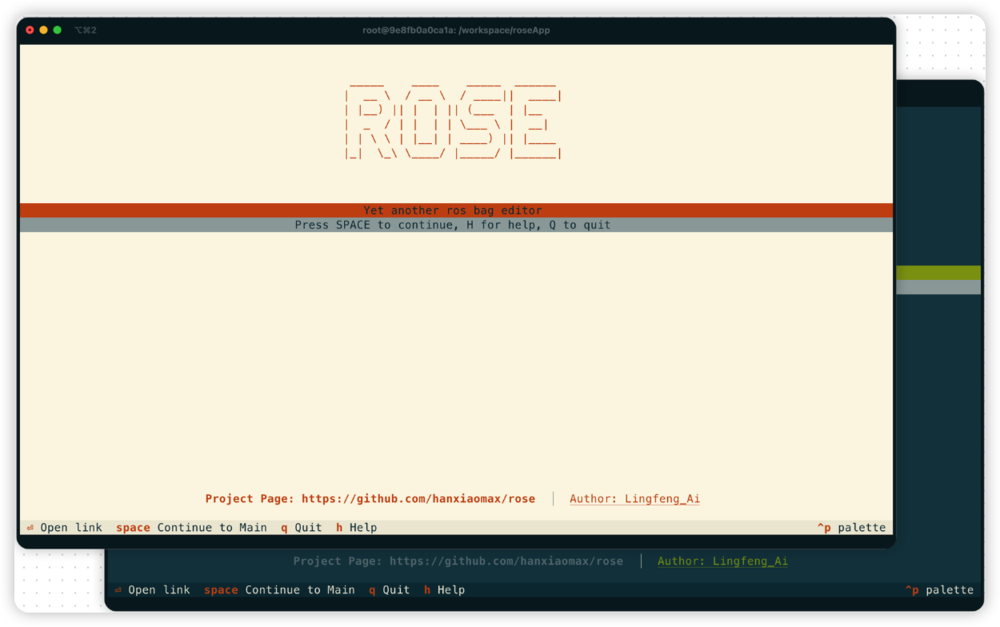
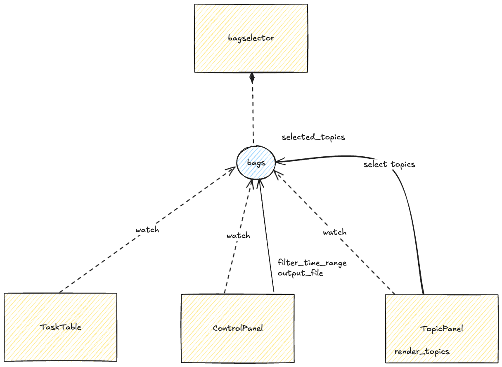

# ROSE - Yet Another ROS Bag Filter Tool

A high-performance ROS bag filtering tool that allows you to extract specific topics from ROSv1 bag files. Built with C++ core and Python interface, it provides both command-line and TUI interfaces for efficient bag file processing.


>inspired by [rosbag_editor](https://github.com/facontidavide/rosbag_editor)


## Aesthetic 

> The cassette tape, a modest analog artifact, has evolved into a retro-futurism icon, demonstrating that technological advancement can coexist with human touch. Its tactile interface and physical limitations serve as poignant reminders of our technological heritage.

> 磁带盒不仅是一种技术遗物，更是复古未来主义的艺术品和精神图腾。简单的按钮、褪色的塑料外壳和有限的存储容量，既是怀旧的载体，也是对数字霸权的温柔反抗。它时刻提醒着我们：技术的突飞猛进不应该以牺牲人性为代价，克制的设计往往更能打动人心。

The TUI embraces the **cassette futurism** aesthetic - a design philosophy that reimagines future interfaces through the lens of 20th century technological fossils. This intentional retrofuturism features:

- **Nostalgic minimalism**: Low-resolution displays and monochromatic schemes that evoke 1980s computing
- **Tactile authenticity**: Visual metaphors of physical media like magnetic tapes and CRT textures
- **Humanized technology**: Warm color palettes and "imperfect" interfaces that resist digital sterility

More than mere retro styling, this approach serves as poetic resistance to digital hegemony. The cassette tape - our central metaphor - embodies this duality: 




## Key Features and Todos

- 🎉 ROS Environment independent using [rosbags](https://pypi.org/project/rosbags/)
- 🌟 Interactive TUI for easy operation
- 🌟 Command-line interface for automation
- 🌟 Interactive CLI for guided operations
- Filter ROS bag files 
  - 🌟 with whitelists 
  - with manually selected topics
  - by time range (only TUI tested)
- 🌟 **Bag file compression support** - Reduce file sizes significantly
  - BZ2 compression (best compression ratio)
  - LZ4 compression (faster compression/decompression)
  - No compression (fastest processing)
- 🌟 Fuzzy search topic in TUI
- 🌟 Multi-selection mode for batch processing in TUI (note:partially supported, rename and time range based filtering not supported yet) 
   - 🌟 parallel processing for Multi-selection mode
- Docker support for cross-platform usage
- 🌟 Customizable cassette futurism theme via YAML configuration
- 🌟 **Plugin System** - Extensible architecture for custom functionality
  - 🔌 Hot-loadable plugins with hook system
  - 📊 Data interface for safe bag data access
  - 🛠️ Custom CLI commands support
  - 📝 Multiple plugin templates (basic, data_processor, hook_example)
- 🚧 Message view in TUI
- 🚧 Support dynamic file/whitelist refresh in TUI

## Getting Started

### Installation

1. Install rose-bag from pypi
```bash
pip install rose-bag
```

2. Install from the source
```bash
# Clone the repository
git clone https://github.com/hanxiaomax/rose.git
cd rose

# Install dependencies
pip install -r requirements.txt
```

To uninstall Rose, run the following command:
```bash
pip uninstall rose-bag
```

### Terminal Setup

To ensure proper color display in your terminal, set the following environment variable:
```bash
# Add this to your bashrc or zshrc
export TERM=xterm-256color
```

No ROS bag file? No problem! Download [webviz demo.bag](https://storage.googleapis.com/cruise-webviz-public/demo.bag) and give it a try!

## Usage


### Command Line Interface

### Inline CLI

Rose provides a command-line tool for direct bag file operations. Currently, it supports the filter command:

```bash
# Basic usage for single file
rose filter <input_bag> <output_bag> [OPTIONS]

# Basic usage for directory
rose filter <input_directory> <output_directory> [OPTIONS]
```

**Parameters:**

- `<input_bag/directory>`: Path to the input bag file or directory containing bag files (required)
- `<output_bag/directory>`: Path to the output bag file (for single file) or directory (required for directory input)

**Options:**

- `-w, --whitelist TEXT`: Specify a topic whitelist file path
- `-t, --topics TEXT`: Specify topics to include, can be used multiple times to add multiple topics
- `-p, --parallel`: Process files in parallel when input is a directory
- `--workers INTEGER`: Number of parallel workers (default: CPU count - 2)
- `--dry-run`: Preview the operation without actually executing it
- `--help`: Show help information

**Usage Examples:**

1. Filter a single bag file using a whitelist:
   ```bash
   rose filter input.bag output.bag -w whitelist.txt
   ```

2. Filter specific topics from a single file:
   ```bash
   rose filter input.bag output.bag -t /topic1 -t /topic2 -t /topic3
   ```

3. Process all bag files in a directory:
   ```bash
   rose filter input_dir/ output_dir/ -w whitelist.txt
   ```

4. Process directory with parallel execution:
   ```bash
   rose filter input_dir/ output_dir/ -w whitelist.txt --parallel
   ```

5. Preview filtering results without execution:
   ```bash
   rose filter input.bag output.bag -w whitelist.txt --dry-run
   ```


### Interactive CLI

For a guided experience with interactive prompts:

```bash
# Launch the interactive CLI tool
rose cli
```

The interactive CLI provides:
- Menu-driven interface for bag file operations
- Guided workflow for filtering and whitelist management
- Batch processing capabilities for multiple files
- Progress indicators and detailed results

Key features:
- Load single bag files or entire directories
- Select topics with fuzzy search
- Create, view, and manage whitelists
- Process multiple files in batch mode

#### Single Bag Processing


#### Multi-Bag Processing


### Interactive Environment

Rose also provides a powerful REPL-style interactive environment:

```bash
# Launch the interactive environment
rose interactive
```

**Features:**
- **Automatic Workspace Status**: See your working directory, configuration, cache, loaded bags, and selected topics at startup
- **Background Task Execution**: Long operations don't block the interface
- **Smart Auto-completion**: Tab completion for commands, files, and topics
- **Natural Language Queries**: Ask questions directly without commands
- **Session Management**: Context-aware commands that adapt to your current state

**Workspace Status Display:**

On startup, Rose displays comprehensive workspace information:

```
╭───────────────── Interactive Environment ─────────────────╮
│ Interactive Environment                                   │
│                                                           │
│ Workspace Status:                                         │
│   Working Directory: /workspaces/rose                     │
│   Configuration: rose.config.yaml                         │
│   Cache: 3 entries, 2.5 MB                                │
│   Loaded Bags: 2 bag(s)                                   │
│   Selected Topics: 5 topic(s)                             │
│                                                           │
│ Available commands:                                       │
│   /load      - Load bag files                             │
│   /extract   - Extract topics from bags                   │
│   /inspect   - Inspect bag contents                       │
│   ...                                                     │
╰───────────────────────────────────────────────────────────╯
```

**Key Commands:**
- `/load [files]` - Load bag files with glob pattern support
- `/extract` - Extract topics with interactive selection
- `/inspect` - Inspect bag contents and statistics
- `/bags` - Manage loaded bags in workspace
- `/topics` - Manage topic selection
- `/cache` - Cache management operations
- `/help` - Show comprehensive help

See [Interactive Help](roseApp/interactive/help.md) for detailed documentation.

### Plugin System

Rose features a powerful plugin system that allows you to extend functionality without modifying core code:

```bash
# List available plugins
rose plugin list

# Create a new plugin
rose plugin create my_plugin --template basic

# Run plugin commands
rose plugin run my_plugin hello

# Install plugin from file
rose plugin install /path/to/plugin.py
```

**Plugin Features:**
- 🔌 **Hot-loadable plugins**: Load and reload plugins without restarting
- 🎣 **Hook system**: Execute custom logic before/after Rose operations
- 📊 **Data interface**: Safe access to bag data and DataFrames
- 🛠️ **Custom CLI commands**: Plugins can provide their own commands
- 📝 **Multiple templates**: Basic, data processor, and hook examples

**Plugin Templates:**
- `basic` - Simple plugin with CLI commands
- `data_processor` - Advanced data analysis and processing
- `hook_example` - Demonstrates hook system usage

See [Plugin Documentation](docs/PLUGIN_README.md) for detailed guides and examples.


### TUI Interface

> [!IMPORTANT]
> If you experience color display issues in your terminal, set the following environment variable:
> ```bash
> export TERM=xterm-256color
> ```
> This ensures proper color rendering in both CLI and TUI interfaces.

For a full-featured terminal user interface:

```bash
# Launch the TUI
rose tui
```


Key bindings:
- `q`: to quit
- `f`: to filter bag files
- `w`: to load whitelist
- `s`: to save whitelist
- `a`: to toggle select all topics

## Compression Support

Rose supports automatic compression of filtered bag files to significantly reduce file sizes. This is especially useful for storing and transferring large bag files.

### Available Compression Types

| Type | Description | Compression Ratio | Speed | Use Case |
|------|-------------|------------------|-------|----------|
| `none` | No compression | 0% | Fastest | When processing speed is critical |
| `bz2` | BZ2 compression | ~80-90% | Slower | Best for long-term storage |
| `lz4` | LZ4 compression | ~60-70% | Faster | Good balance of speed and compression |

### Using Compression

Compression options are presented to users during the filtering process. By default, Rose uses no compression for fastest processing speed. Users can choose from:

- **No compression**: Fastest processing, largest files
- **BZ2 compression**: Best compression ratio, slower processing  
- **LZ4 compression**: Balanced speed and compression

**Example compression results:**
- Original bag file: 696.15 MB
- After BZ2 compression: 92.03 MB  
- **Compression ratio: 86.8%**

### Programmatic Usage

```python
from roseApp.core.BagManager import BagManager, CompressionType
from roseApp.core.parser import create_parser, ParserType

# Create parser and bag manager
parser = create_parser(ParserType.PYTHON)
bag_manager = BagManager(parser)

# Load bag and select topics
bag_manager.load_bag(Path("input.bag"))
bag_manager.select_topic("/your_topic")

# Get filter configuration with desired compression
bag = bag_manager.get_single_bag()
config = bag.get_filter_config(compression="bz2")  # or "none", "lz4"

# Filter with specified compression
bag_manager.filter_bag(Path("input.bag"), config, Path("output.bag"))
```

### Command Line Usage

```bash
# Filter with BZ2 compression
rose filter input.bag output.bag -w whitelist.txt -c bz2

# Filter with no compression (fastest)
rose filter input.bag output.bag -w whitelist.txt -c none

# Filter with LZ4 compression (balanced)
rose filter input.bag output.bag -w whitelist.txt -c lz4
```

> **Note**: LZ4 compression requires additional system dependencies. If LZ4 is not available, BZ2 compression will be used as fallback.

#### Configuration

Rose uses a unified configuration system with automatic validation. Configuration is loaded from `rose.config.yaml` in your project directory.

**Quick Start:**
```bash
# Copy example configuration
cp rose.config.yaml.example rose.config.yaml

# Edit configuration
nano rose.config.yaml
```

**Example Configuration:**
```yaml
# Performance Settings
parallel_workers: 4
memory_limit_mb: 512

# Feature Toggles
enable_cache: true
enable_plugins: true

# Default Behavior
compression_default: none
verbose_default: false
build_index_default: false

# Logging Settings
log_level: INFO
log_to_file: true

# UI Settings
theme_file: rose.theme.default.yaml
enable_colors: true

# Directory Settings
output_directory: output
```

**Configuration Hierarchy:**
1. Command-line arguments (highest priority)
2. Environment variables (`ROSE_*` prefix)
3. Configuration file (`rose.config.yaml`)
4. System defaults (lowest priority)

**Environment Variable Override:**
```bash
# Override parallel workers
export ROSE_PARALLEL_WORKERS=8

# Change log level
export ROSE_LOG_LEVEL=DEBUG

# Run Rose
rose load demo.bag
```

**Automatic Validation:**

Rose validates configuration on startup and displays warnings for potential issues:

```
Config: rose.config.yaml
Warning: Workers (32) > CPU count (8)
Warning: Theme file not found: custom-theme.yaml
```

See [Configuration Guide](docs/CONFIGURATION.md) for complete reference.

#### Theme System

Rose CLI uses a simple and powerful YAML-based theme system with support for multiple named themes.

##### Quick Start

**View available themes:**
```bash
rose theme list-themes
```

**Switch themes:**
```bash
rose theme use blue      # Switch to blue theme
rose theme use orange    # Switch to orange theme
rose theme use green     # Switch to green theme
```

##### Simple Theme System

Rose uses a simple YAML-based theme system for customizing UI colors.

**Default Theme**: Rose uses `rose.theme.default.yaml` (orange cassette aesthetic)

**Create Custom Theme**:

1. Copy the default theme:
   ```bash
   cp rose.theme.default.yaml rose.theme.custom.yaml
   ```

2. Edit colors in `rose.theme.custom.yaml`:
   ```yaml
   # Custom theme colors
   colors:
     primary: blue           # Main accent color
     accent: cyan            # Secondary accent
     
     success: green          # Success messages
     warning: yellow         # Warning messages
     error: red              # Error messages
     info: cyan              # Info messages
     
     muted: gray             # Muted text
     highlight: white        # Highlighted text
     
     file: cyan              # File names
     directory: blue         # Directory names
     topic: magenta          # ROS topics
     timestamp: gray         # Timestamps
   ```

3. Configure in `rose.config.yaml`:
   ```yaml
   theme_file: "rose.theme.custom.yaml"
   ```

**Note**: Theme files are automatically searched in the same directory as `rose.config.yaml`, so you can keep your theme and config files together.

**Theme File Search Paths**:

1. Same directory as `rose.config.yaml` (highest priority)
2. Current directory (`.`)
3. Project root (where `pyproject.toml` is)
4. User config (`~/.rose/`)
5. System config (`/etc/rose/`)

**Available Colors**:

- **Primary**: `primary`, `accent` - Main accent colors
- **Status**: `success`, `warning`, `error`, `info` - Status indicators
- **UI**: `muted`, `highlight` - UI elements
- **Semantic**: `path` - File and directory paths

##### Advanced Usage

**Per-project themes:**
```bash
# Use different themes for different projects
cd project1/
rose theme use blue

cd project2/
rose theme use green
```

**Share custom themes:**
```bash
# Export your theme
cp ~/.rose/theme.custom.yaml my-theme.yaml

# Share with team
# Others can copy to their ~/.rose/ directory
```

For more details, see [Theme Quick Start Guide](docs/THEME_QUICKSTART.md).


### Whitelist

You can filter bag files with pre-configured whitelist. To select pre-configured whitelists, press `w` in TUI. But before that, you need to create your own whitelist.

You can create your own whitelist in 3 ways:

#### 1. Create topic whitelist with your favorite text editor and save it to `whitelist/`:


#### 2. Create whitelist with interactive cli and choose **2. whitelist**:
```bash
rose cli
```


#### 3. Create topic in TUI by press `s` to save current selected topics as whitelist file to `whitelist/` directory:

you can create/view/delete whitelists


After whitelist created, add it to `config.json` so RoseApp can find it:
```json
{
    "whitelists": {
        "demo": "./whitelists/demo.txt",
        "radar": "./whitelists/radar.txt",
        "invalid": "./whitelists/invalid.txt"
    }
}
```

## Development

### Run locally

```bash
python -m roseApp.rose --help
```

### Publishing to PyPI

To publish a new version to PyPI:

1. Update version in `pyproject.toml`
2. Install required tools:
```bash
pip install keyring keyrings.alt
```

3. Configure PyPI credentials:
```bash
# Using environment variables
export HATCH_INDEX_USER=__token__
export HATCH_INDEX_AUTH=your_pypi_token

# Or using hatch config
hatch config set pypi.auth.username __token__
hatch config set pypi.auth.password your_pypi_token
```

4. Build and publish:
```bash
# Build the package
hatch build

# Publish to PyPI
hatch publish
```

### Project Structure
```
project_root/
├── roseApp/                # Python application
│   ├── rose.py             # Main entry script
│   ├── cli/                # CLI tools
│   │   ├── cli_tool.py     # Interactive CLI implementation
│   │   ├── theme.py        # CLI theme and color configuration
│   │   └── <inline-cmd>.py # Command-line commands implementation
│   ├── core/               # Core functionality
│   │   ├── parser.py       # Bag file parser
│   │   └── util.py         # Utility functions and logging
│   ├── tui/                # TUI components
│   │   ├── tui.py          # Main TUI application
│   │   └── components/     # Custom widgets
│   │   ├── config.json     # Configuration file
│   │   ├── themes/         # TUI themes
│   │   └── style.tcss          # TUI style sheet
│   ├── whitelists/         # Topic whitelist folder
│   │   └── *.txt           # Whitelist files
├── docker/                 # Docker support
│   ├── Dockerfile
│   └── go_docker.sh
├── docs/                   # Documentation
├── pyproject.toml          # Project metadata and dependencies
├── requirements.txt        # Development dependencies
└── README.md               # Project documentation
```

### Tech stack

- **[Textual](https://textual.textualize.io/)**: A Python framework for building sophisticated TUI applications. Used for creating the interactive terminal interface.
- **[Rich](https://rich.readthedocs.io/)**: A Python library for rich text and beautiful formatting in the terminal. Used for enhancing the visual presentation in both CLI and TUI.
- **[InquirerPy](https://github.com/kazhala/InquirerPy)**: A Python library for building interactive command line interfaces with elegant prompts. Used for the interactive CLI.
- **[Typer](https://typer.tiangolo.com/)**: A Python library for building CLI applications. Used for building the inline command-line interface.
- **[rosbags](https://pypi.org/project/rosbags/)**: A pure Python library for reading and writing ROS bag files. Used for ROS bag file processing without ROS dependencies.

### Rough ideas - data driven rendering



>[!TIP]
> Before you start with Textual, there are some docs worth reading:
>
> - [Textual devtools](https://textual.textualize.io/guide/devtools/) on how to use `textual run <your app> --dev` to go into dev mode and how to handle logs
> - [Design a layout](https://textual.textualize.io/how-to/design-a-layout/) 、[TextualCSS](https://textual.textualize.io/guide/CSS/) and [CSS Types](https://textual.textualize.io/css_types/) to understand how to design a layout and style your app with CSS. and more tips on [Styles](https://textual.textualize.io/guide/styles/) and its [reference](https://textual.textualize.io/styles/)
> - [Event and Messages](https://textual.textualize.io/guide/events/) are also important ideas to understand how Textual works so you can handle [actions](https://textual.textualize.io/guide/actions/)
> - Thanks to [Workers](https://textual.textualize.io/guide/workers/), asynchronous operations never been so easy. it can supppot asyncio or threads.

## Resources

- Demo bag file: [webviz demo.bag](https://storage.googleapis.com/cruise-webviz-public/demo.bag)


