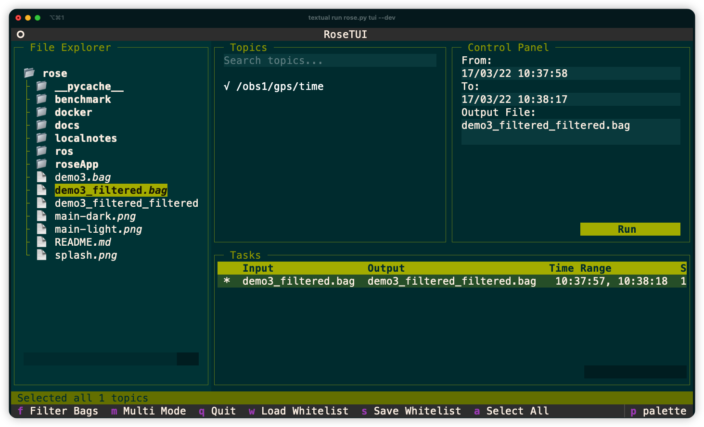

# ROSE - Yet Another ROS Bag Filter Tool

A high-performance ROS bag filtering tool that allows you to extract specific topics from ROSv1 bag files. Built with C++ core and Python interface, it provides both command-line and TUI interfaces for efficient bag file processing.


>inspired by [rosbag_editor](https://github.com/facontidavide/rosbag_editor)


## Aesthetic 

> The cassette tape, a modest analog artifact, has evolved into a retro-futurism icon, demonstrating that technological advancement can coexist with human touch. Its tactile interface and physical limitations serve as poignant reminders of our technological heritage.

> 磁带盒不仅是一种技术遗物，更是复古未来主义的艺术品和精神图腾。简单的按钮、褪色的塑料外壳和有限的存储容量，既是怀旧的载体，也是对数字霸权的温柔反抗。它时刻提醒着我们：技术的突飞猛进不应该以牺牲人性为代价，克制的设计往往更能打动人心。

The TUI embraces the **cassette futurism** aesthetic - a design philosophy that reimagines future interfaces through the lens of 20th century technological fossils. This intentional retrofuturism features:

- **Nostalgic minimalism**: Low-resolution displays and monochromatic schemes that evoke 1980s computing
- **Tactile authenticity**: Visual metaphors of physical media like magnetic tapes and CRT textures
- **Humanized technology**: Warm color palettes and "imperfect" interfaces that resist digital sterility

More than mere retro styling, this approach serves as poetic resistance to digital hegemony. The cassette tape - our central metaphor - embodies this duality: 


## Key Features and Todos

- High-performance C++ processing core
  - 🚧 make C++ interface asynchronous
- 🌟 Interactive TUI for easy operation
- Command-line interface for automation
- Filter ROS bag files 
  - 🌟 with whitelists 
  - with manually selected topics
  - by time range (only TUI tested)
- 🌟 Fuzzy search topic in TUI
- 🌟 Multi-selection mode for batch processing in TUI (note:partially supported, rename and time range based filtering not supported yet) 
   - 🚧 parallel processing for Multi-selection mode
- Docker support for cross-platform usage
- 🌟 cassette futurism theme for dark and light mode
- 🚧 Message view in TUI
- 🚧 Support dynamic file/whitelist refresh in TUI 

## Getting Started

First, Clone the repository
```bash
git clone https://github.com/your-repo/rose.git
cd rose
```

Second, since Rose depends on [ROS Noetic](https://wiki.ros.org/noetic/Installation) environment, you need to install it first.

#### Option 1: Install ROS Noetic (Ubuntu 20.04), refer to [ROS Noetic Installation](http://wiki.ros.org/noetic/Installation)

#### Option 2: Use docker image
1. Build the Docker image:
   ```bash
   cd docker
   docker build -t rose .
   ```
2. Run the container:
   ```bash
   ./go_docker.sh
   ```

Once you have ros environment installed, you can build `rosbag_io_py` lib which is required by roseApp to operate.

1. Build the ROS project:
   ```bash
   cd ros
   ./build.sh
   ```

2. Set up environment which will make sure `rosbag_io_py` add to `PYTHONPATH`
   ```bash
   source setup.sh
   ```
  
**You are all set! Now you can use RoseApp to filter ROS bag files.**

No Ros bag file? No problem! Download [webviz demo.bag](https://storage.googleapis.com/cruise-webviz-public/demo.bag) and have a try!

## Usage

### Command Line Interface

1. Inspect bag file contents:
   ```bash
   ./rose.py inspect input.bag
   ```

2. Filter bag file with whitelist:
   ```bash
   ./rose.py filter input.bag output.bag --whitelist topics.txt
   ```

### TUI Interface

To launch the TUI:
```bash
python3 rose.py tui
```

2. Some key bindings:
   - `q`: to quit
   - `f`: to filter bag files
   - `w`: to load whitelist
   - `s`: to save whitelist
   - `a`: to toggle select all topics

#### Configuration

Rose is configured with `roseApp/config.json`.
```json
{
    "show_splash_screen": true,
    "theme": "cassette-light",
    "whitelists": {
        "demo": "./whitelists/demo.txt",
        "radar": "./whitelists/radar.txt",
        "invalid": "./whitelists/invalid.txt",
    }
}
```

- `show_splash_screen`: whether to show the splash screen, default is true
- `theme`: the theme of the TUI, default is `cassette-light`,check [Theme](#theme) for more details
- `whitelists`: the whitelists of the TUI, default is empty,check [Whitelist](#whitelist) for more details


#### Theme
RoseApp TUI provides two built-in themes: `cassette-light` (default) and `cassette-dark`. You can configure the theme in two ways:

| cassette-light | cassette-dark |
|------------|-------------|
|  |  |

1. Modify `config.json` to specify your preferred theme:

```json
{
    "theme": "cassette-dark",
}
```
2. Switch Theme in TUI with command palette(the buttom in bottom right corner or keybinding ^p)


#### Whitelist

You can filter bag files with pre-configured whitelist. To select pre-configured whitelists, press `w` in TUI. But before that, you need to create your own whitelist.

You can create your own whitelist in 3 ways:

1. Create topic whitelist from command line:
   ```bash
   ./rose.py inspect input.bag | awk '{print $1}' > whitelist/example.txt
   ```

2. Create topic whitelist with your favorite text editor and save it to `whitelist/`:

3. Create topic in TUI by press `s` to save current selected topics as whitelist file to `whitelist/` directory:

After whitelist created, add it to `config.json` so RoseApp can find it:
```json
{
    "whitelists": {
        "demo": "./whitelists/demo.txt",
        "radar": "./whitelists/radar.txt",
        "invalid": "./whitelists/invalid.txt",
    }
}
```

## Development

Use Dev container(build with ./docker/Dockerfile-dev) or local environment to develop RoseApp. refer [devtoos](https://textual.textualize.io/guide/devtools/) when debugging TUI.

### Tech stack

- **[Textual](https://textual.textualize.io/)**: A Python framework for building sophisticated TUI (Text User Interface) applications. Used for creating the interactive terminal interface.
- **[Click](https://click.palletsprojects.com/)**: A Python package for creating beautiful command line interfaces in a composable way. Used for building the CLI interface.
- **[Rich](https://rich.readthedocs.io/)**: A Python library for rich text and beautiful formatting in the terminal. Used for enhancing the visual presentation of both CLI and TUI.
- **[Pybind11](https://pybind11.readthedocs.io/)**: A lightweight header-only library that exposes C++ types in Python and vice versa. Used for wrapping ROS C++ interfaces to Python.


### Project Structure
```
project_root/
├── ros/            # ROS C++ core
│   ├── CMakeLists.txt
│   ├── devel/      # ros development folder
│   ├── build/      # build folder
│   ├── src/        # source code folder
|   ├── setup.sh    # setup script
|   └── build_rosecode.sh # build script
├── roseApp/        # Python application
│   ├── rose.py     # main script
│   ├── themes/     # theme folder
│   ├── whitelists/ # topic whitelist folder
│   ├── config.json # config file
│   └── style.css   # style sheet
├── docker/              # Docker support
│   └── Dockerfile
│   └── go_docker.sh
├── docs/         # documentation
├── requirements.txt # dependencies
├── README.md     
```

### Textual

Before you start with Textual, there are some docs worth reading:

- [Textual devtools](https://textual.textualize.io/guide/devtools/) on how to use `textual run <your app> --dev` to go into dev mode and how to handle logs
- [Design a layout](https://textual.textualize.io/how-to/design-a-layout/) 、[TextualCSS](https://textual.textualize.io/guide/CSS/) and [CSS Types](https://textual.textualize.io/css_types/) to understand how to design a layout and style your app with CSS. and more tips on [Styles](https://textual.textualize.io/guide/styles/) and its [reference](https://textual.textualize.io/styles/)
- [Event and Messages](https://textual.textualize.io/guide/events/) are also important ideas to understand how Textual works so you can handle [actions](https://textual.textualize.io/guide/actions/)
- Thanks to [Workers](https://textual.textualize.io/guide/workers/), asynchronous operations never been so easy. it can supppot asyncio or threads.


## Resources

- Demo bag file: [webviz demo.bag](https://storage.googleapis.com/cruise-webviz-public/demo.bag)
- [ROS Noetic Installation](http://wiki.ros.org/noetic/Installation)


