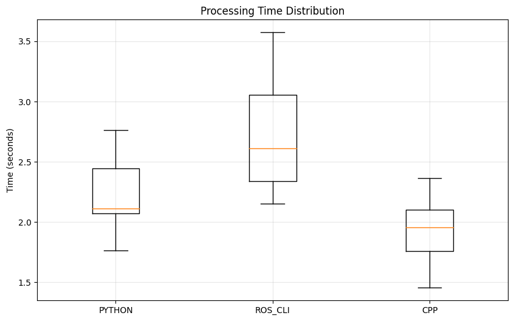

# Rosbag Performance Benchmark


## Result




## Dependencies

Ensure you have the following Python packages installed:
```bash
pip install rosbag matplotlib pandas tqdm numpy
```

The `rosbag_io_py` package is required for testing the C++ implementation.

## Usage

### Single Benchmark Run
1. Run the benchmark:
```bash
python rosbag_benchmark.py path/to/your/bagfile.bag [--output results.json]
```

2. Visualize results:
```bash
python visualize.py results.json [--output-dir benchmark_results]
```

### Multiple Runs with Statistical Analysis
Run multiple benchmarks and generate statistical analysis:
```bash
python run_benchmarks.py path/to/your/bagfile.bag [--runs N] [--output-dir DIR]
```

Options:
- `--runs`: Number of benchmark runs (default: 5)
- `--output-dir`: Directory to save results (default: benchmark_stats)

## Output Files

### Single Run Output
1. Detailed test results in JSON format
2. Processed bag file using Python implementation
3. Processed bag file using C++ implementation (if available)
4. Visualization results:
   - Processing time comparison chart
   - Message throughput comparison chart
   - Detailed Markdown report

### Statistical Analysis Output
1. Individual JSON results for each run
2. Statistical report including:
   - Mean processing time
   - Standard deviation
   - Min/max times
   - Median time
3. Box plot showing time distribution
4. Performance comparison between implementations

## Example

```bash
# Run a single benchmark
python rosbag_benchmark.py demo.bag

# Run multiple benchmarks with statistics
python run_benchmarks.py demo.bag --runs 10

# Visualize single run results
python visualize.py benchmark_results.json
```

## Notes

1. Ensure sufficient disk space as output files will be similar in size to input
2. Processing large bag files may take considerable time
3. If `rosbag_io_py` is not available, only the Python implementation will be tested 

