# Rose Architecture Design Document

## Overview

After comprehensive refactoring, Rose adopts a modern layered architecture design, consolidating from 19 scattered files into 6 core modules. The new architecture emphasizes modularity, high performance, and ease of use, providing a unified and efficient solution for ROS bag file processing.

## Overall Architecture

### System Layered Architecture

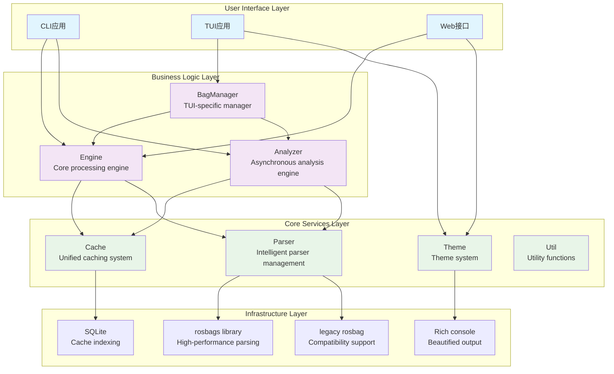
```mermaid
graph TB
    subgraph "User Interface Layer"
        CLI[CLI应用]
        TUI[TUI应用]
        WEB[Web接口]
    end
    
    subgraph "Business Logic Layer"
        BM[BagManager<br/>TUI-specific manager]
        ENG[Engine<br/>Core processing engine]
        ANA[Analyzer<br/>Asynchronous analysis engine]
    end
    
    subgraph "Core Services Layer"
        CACHE[Cache<br/>Unified caching system]
        PARSER[Parser<br/>Intelligent parser management]
        THEME[Theme<br/>Theme system]
        UTIL[Util<br/>Utility functions]
    end
    
    subgraph "Infrastructure Layer"
        ROSBAGS[rosbags library<br/>High-performance parsing]
        LEGACY[legacy rosbag<br/>Compatibility support]
        RICH[Rich console<br/>Beautified output]
        SQLITE[SQLite<br/>Cache indexing]
    end
    
    CLI --> ENG
    CLI --> ANA
    TUI --> BM
    TUI --> THEME
    WEB --> ENG
    WEB --> THEME
    
    BM --> ENG
    BM --> ANA
    ENG --> CACHE
    ENG --> PARSER
    ANA --> CACHE
    ANA --> PARSER
    
    CACHE --> SQLITE
    PARSER --> ROSBAGS
    PARSER --> LEGACY
    THEME --> RICH
    
    style CLI fill:#e1f5fe
    style TUI fill:#e1f5fe
    style WEB fill:#e1f5fe
    style ENG fill:#f3e5f5
    style ANA fill:#f3e5f5
    style BM fill:#f3e5f5
    style CACHE fill:#e8f5e8
    style PARSER fill:#e8f5e8
    style THEME fill:#e8f5e8
    style UTIL fill:#e8f5e8
```

### Core Module Relationship Diagram

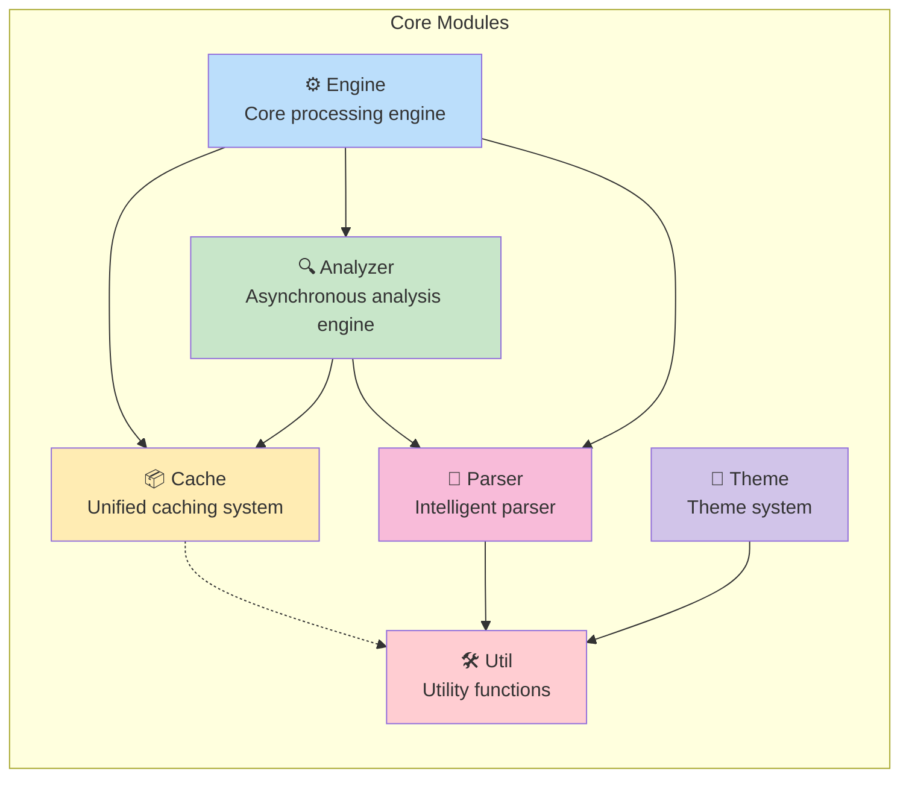
```mermaid
graph LR
    subgraph "Core Modules"
        CACHE[📦 Cache<br/>Unified caching system]
        ANALYZER[🔍 Analyzer<br/>Asynchronous analysis engine]
        ENGINE[⚙️ Engine<br/>Core processing engine]
        PARSER[📄 Parser<br/>Intelligent parser]
        THEME[🎨 Theme<br/>Theme system]
        UTIL[🛠️ Util<br/>Utility functions]
    end
    
    ENGINE --> CACHE
    ENGINE --> ANALYZER
    ENGINE --> PARSER
    
    ANALYZER --> CACHE
    ANALYZER --> PARSER
    
    PARSER --> UTIL
    THEME --> UTIL
    
    CACHE -.-> UTIL
    
    style CACHE fill:#ffecb3
    style ANALYZER fill:#c8e6c9
    style ENGINE fill:#bbdefb
    style PARSER fill:#f8bbd9
    style THEME fill:#d1c4e9
    style UTIL fill:#ffcdd2
```

## Core Module Detailed Design

### 1. Caching System (cache.py)

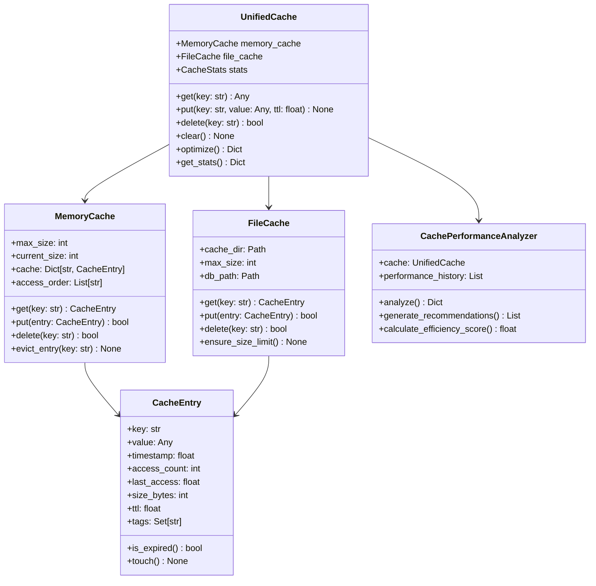
```mermaid
classDiagram
    class UnifiedCache {
        +MemoryCache memory_cache
        +FileCache file_cache
        +CacheStats stats
        +get(key: str) Any
        +put(key: str, value: Any, ttl: float) None
        +delete(key: str) bool
        +clear() None
        +optimize() Dict
        +get_stats() Dict
    }
    
    class MemoryCache {
        +max_size: int
        +current_size: int
        +cache: Dict[str, CacheEntry]
        +access_order: List[str]
        +get(key: str) CacheEntry
        +put(entry: CacheEntry) bool
        +delete(key: str) bool
        +evict_entry(key: str) None
    }
    
    class FileCache {
        +cache_dir: Path
        +max_size: int
        +db_path: Path
        +get(key: str) CacheEntry
        +put(entry: CacheEntry) bool
        +delete(key: str) bool
        +ensure_size_limit() None
    }
    
    class CacheEntry {
        +key: str
        +value: Any
        +timestamp: float
        +access_count: int
        +last_access: float
        +size_bytes: int
        +ttl: float
        +tags: Set[str]
        +is_expired() bool
        +touch() None
    }
    
    class CachePerformanceAnalyzer {
        +cache: UnifiedCache
        +performance_history: List
        +analyze() Dict
        +generate_recommendations() List
        +calculate_efficiency_score() float
    }
    
    UnifiedCache --> MemoryCache
    UnifiedCache --> FileCache
    UnifiedCache --> CachePerformanceAnalyzer
    MemoryCache --> CacheEntry
    FileCache --> CacheEntry
```

**Cache Data Flow**:
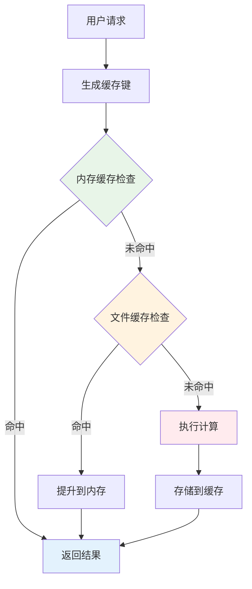
```mermaid
flowchart TD
    REQ[用户请求] --> KEY[生成缓存键]
    KEY --> MEM{内存缓存检查}
    MEM -->|命中| RET[返回结果]
    MEM -->|未命中| FILE{文件缓存检查}
    FILE -->|命中| PROMOTE[提升到内存]
    FILE -->|未命中| COMPUTE[执行计算]
    PROMOTE --> RET
    COMPUTE --> STORE[存储到缓存]
    STORE --> RET
    
    style MEM fill:#e8f5e8
    style FILE fill:#fff3e0
    style COMPUTE fill:#ffebee
    style RET fill:#e3f2fd
```

### 2. Analysis Engine (analyzer.py)

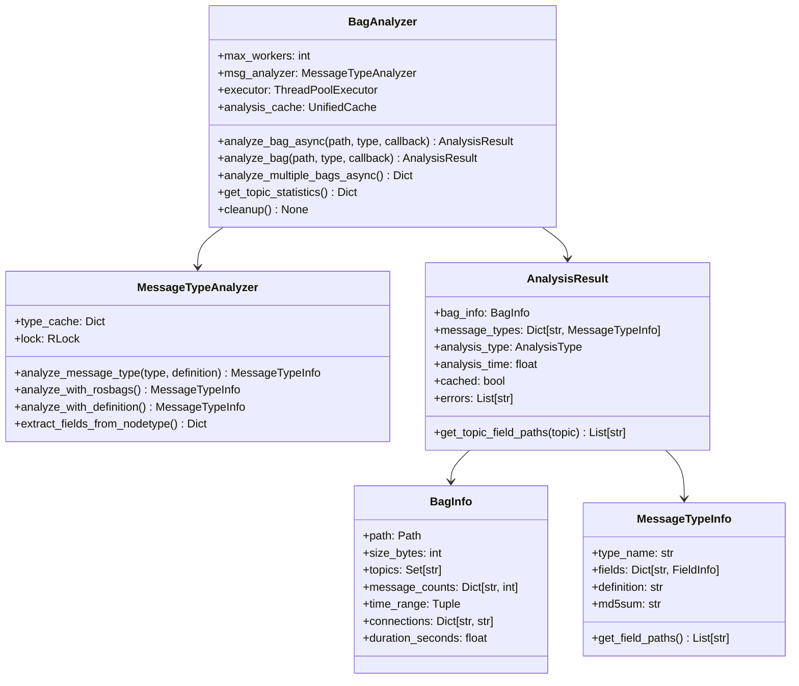
```mermaid
classDiagram
    class BagAnalyzer {
        +max_workers: int
        +msg_analyzer: MessageTypeAnalyzer
        +executor: ThreadPoolExecutor
        +analysis_cache: UnifiedCache
        +analyze_bag_async(path, type, callback) AnalysisResult
        +analyze_bag(path, type, callback) AnalysisResult
        +analyze_multiple_bags_async() Dict
        +get_topic_statistics() Dict
        +cleanup() None
    }
    
    class MessageTypeAnalyzer {
        +type_cache: Dict
        +lock: RLock
        +analyze_message_type(type, definition) MessageTypeInfo
        +analyze_with_rosbags() MessageTypeInfo
        +analyze_with_definition() MessageTypeInfo
        +extract_fields_from_nodetype() Dict
    }
    
    class AnalysisResult {
        +bag_info: BagInfo
        +message_types: Dict[str, MessageTypeInfo]
        +analysis_type: AnalysisType
        +analysis_time: float
        +cached: bool
        +errors: List[str]
        +get_topic_field_paths(topic) List[str]
    }
    
    class BagInfo {
        +path: Path
        +size_bytes: int
        +topics: Set[str]
        +message_counts: Dict[str, int]
        +time_range: Tuple
        +connections: Dict[str, str]
        +duration_seconds: float
    }
    
    class MessageTypeInfo {
        +type_name: str
        +fields: Dict[str, FieldInfo]
        +definition: str
        +md5sum: str
        +get_field_paths() List[str]
    }
    
    BagAnalyzer --> MessageTypeAnalyzer
    BagAnalyzer --> AnalysisResult
    AnalysisResult --> BagInfo
    AnalysisResult --> MessageTypeInfo
```

**Analysis Flow**:
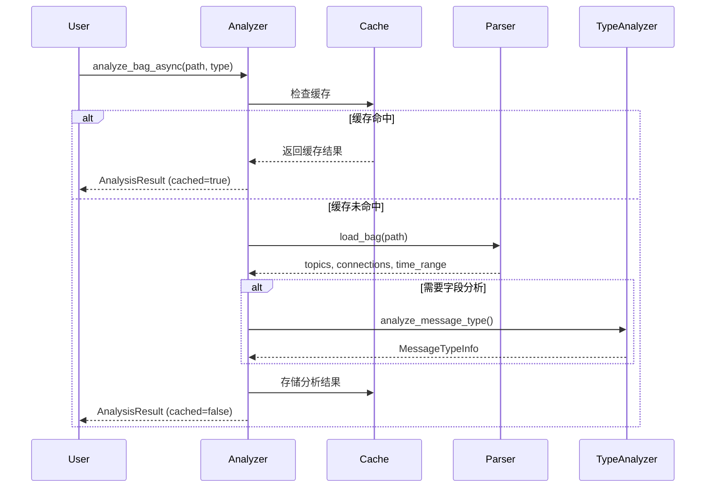
```mermaid
sequenceDiagram
    participant User
    participant Analyzer
    participant Cache
    participant Parser
    participant TypeAnalyzer
    
    User->>Analyzer: analyze_bag_async(path, type)
    Analyzer->>Cache: 检查缓存
    alt 缓存命中
        Cache-->>Analyzer: 返回缓存结果
        Analyzer-->>User: AnalysisResult (cached=true)
    else 缓存未命中
        Analyzer->>Parser: load_bag(path)
        Parser-->>Analyzer: topics, connections, time_range
        
        alt 需要字段分析
            Analyzer->>TypeAnalyzer: analyze_message_type()
            TypeAnalyzer-->>Analyzer: MessageTypeInfo
        end
        
        Analyzer->>Cache: 存储分析结果
        Analyzer-->>User: AnalysisResult (cached=false)
    end
```

### 3. Processing Engine (engine.py)

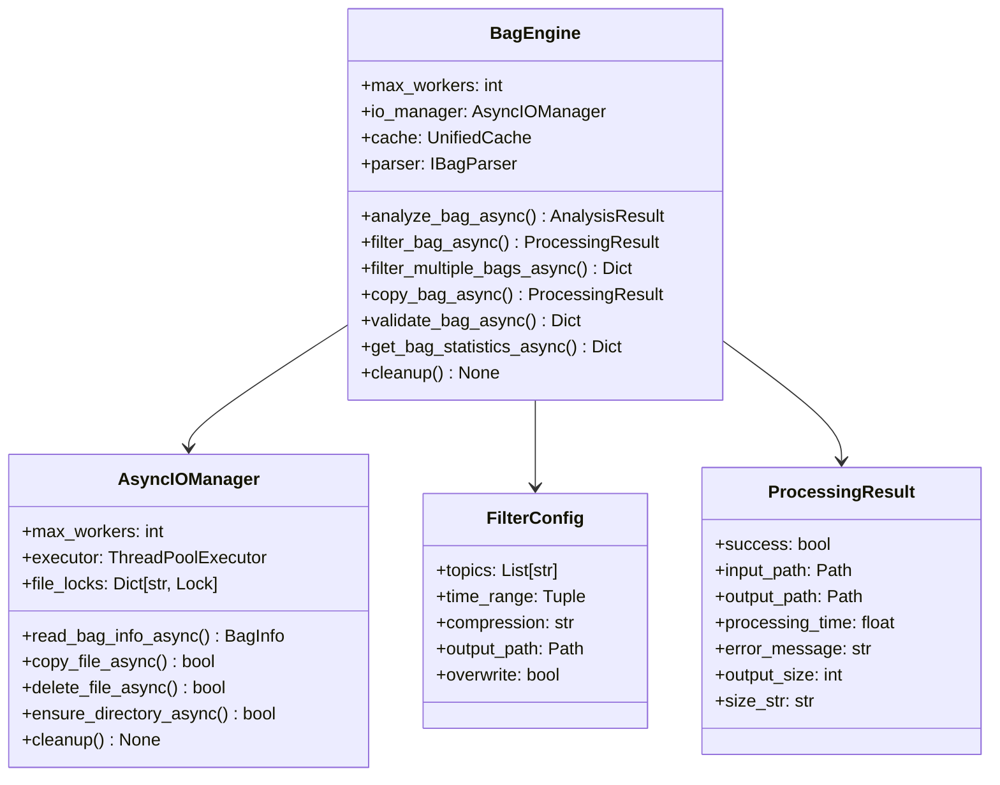
```mermaid
classDiagram
    class BagEngine {
        +max_workers: int
        +io_manager: AsyncIOManager
        +cache: UnifiedCache
        +parser: IBagParser
        +analyze_bag_async() AnalysisResult
        +filter_bag_async() ProcessingResult
        +filter_multiple_bags_async() Dict
        +copy_bag_async() ProcessingResult
        +validate_bag_async() Dict
        +get_bag_statistics_async() Dict
        +cleanup() None
    }
    
    class AsyncIOManager {
        +max_workers: int
        +executor: ThreadPoolExecutor
        +file_locks: Dict[str, Lock]
        +read_bag_info_async() BagInfo
        +copy_file_async() bool
        +delete_file_async() bool
        +ensure_directory_async() bool
        +cleanup() None
    }
    
    class FilterConfig {
        +topics: List[str]
        +time_range: Tuple
        +compression: str
        +output_path: Path
        +overwrite: bool
    }
    
    class ProcessingResult {
        +success: bool
        +input_path: Path
        +output_path: Path
        +processing_time: float
        +error_message: str
        +output_size: int
        +size_str: str
    }
    
    BagEngine --> AsyncIOManager
    BagEngine --> FilterConfig
    BagEngine --> ProcessingResult
```

**Processing Flow**:
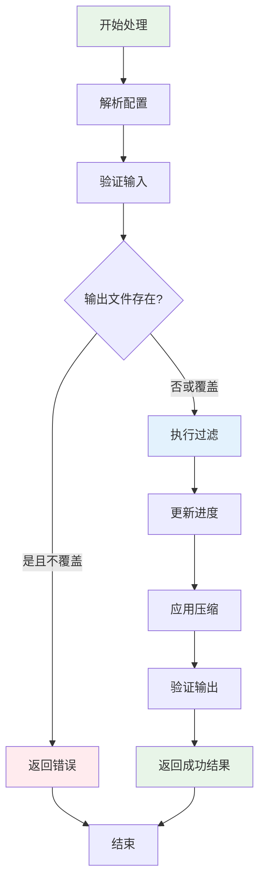
```mermaid
flowchart TD
    START[开始处理] --> CONFIG[解析配置]
    CONFIG --> VALIDATE[验证输入]
    VALIDATE --> EXIST{输出文件存在?}
    EXIST -->|是且不覆盖| ERROR[返回错误]
    EXIST -->|否或覆盖| FILTER[执行过滤]
    
    FILTER --> PROGRESS[更新进度]
    PROGRESS --> COMPRESS[应用压缩]
    COMPRESS --> VERIFY[验证输出]
    VERIFY --> SUCCESS[返回成功结果]
    
    ERROR --> END[结束]
    SUCCESS --> END
    
    style START fill:#e8f5e8
    style SUCCESS fill:#e8f5e8
    style ERROR fill:#ffebee
    style FILTER fill:#e3f2fd
```

### 4. Parser Management (parser.py)

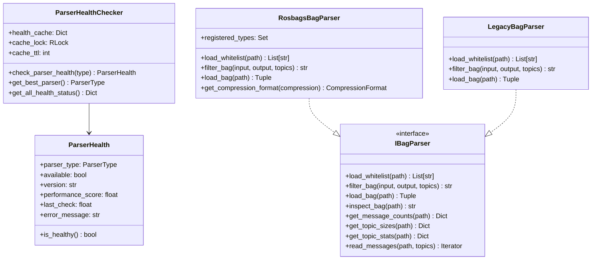
```mermaid
classDiagram
    class ParserHealthChecker {
        +health_cache: Dict
        +cache_lock: RLock
        +cache_ttl: int
        +check_parser_health(type) ParserHealth
        +get_best_parser() ParserType
        +get_all_health_status() Dict
    }
    
    class IBagParser {
        <<interface>>
        +load_whitelist(path) List[str]
        +filter_bag(input, output, topics) str
        +load_bag(path) Tuple
        +inspect_bag(path) str
        +get_message_counts(path) Dict
        +get_topic_sizes(path) Dict
        +get_topic_stats(path) Dict
        +read_messages(path, topics) Iterator
    }
    
    class RosbagsBagParser {
        +registered_types: Set
        +load_whitelist(path) List[str]
        +filter_bag(input, output, topics) str
        +load_bag(path) Tuple
        +get_compression_format(compression) CompressionFormat
    }
    
    class LegacyBagParser {
        +load_whitelist(path) List[str]
        +filter_bag(input, output, topics) str
        +load_bag(path) Tuple
    }
    
    class ParserHealth {
        +parser_type: ParserType
        +available: bool
        +version: str
        +performance_score: float
        +last_check: float
        +error_message: str
        +is_healthy() bool
    }
    
    ParserHealthChecker --> ParserHealth
    RosbagsBagParser ..|> IBagParser
    LegacyBagParser ..|> IBagParser
```

**Parser Selection Flow**:
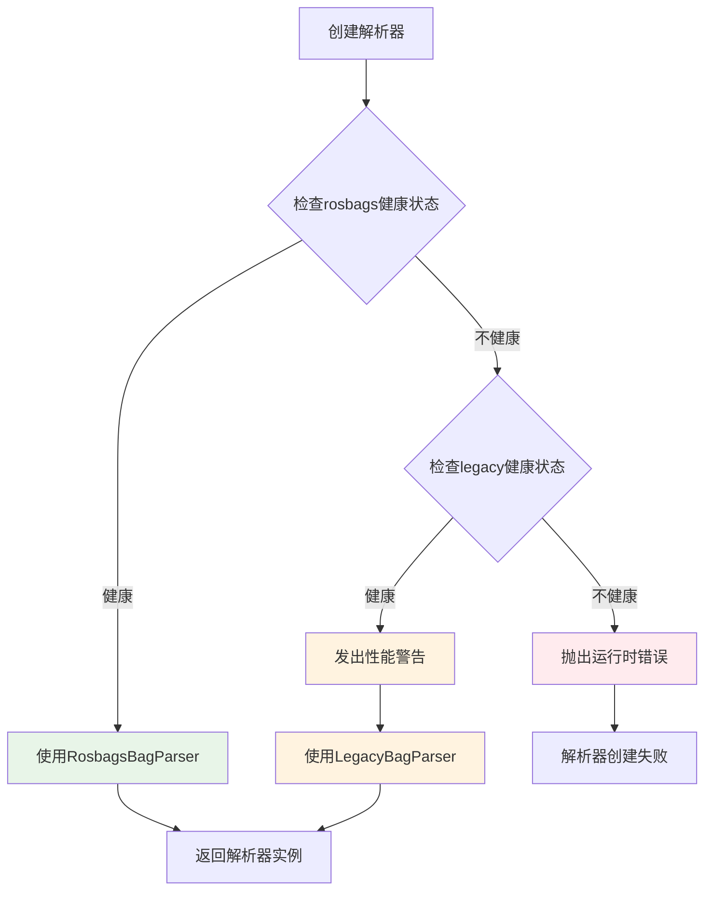
```mermaid
flowchart TD
    START[创建解析器] --> CHECK_ROSBAGS{检查rosbags健康状态}
    CHECK_ROSBAGS -->|健康| USE_ROSBAGS[使用RosbagsBagParser]
    CHECK_ROSBAGS -->|不健康| CHECK_LEGACY{检查legacy健康状态}
    
    CHECK_LEGACY -->|健康| WARN[发出性能警告]
    CHECK_LEGACY -->|不健康| ERROR[抛出运行时错误]
    
    WARN --> USE_LEGACY[使用LegacyBagParser]
    
    USE_ROSBAGS --> END[返回解析器实例]
    USE_LEGACY --> END
    ERROR --> FAIL[解析器创建失败]
    
    style USE_ROSBAGS fill:#e8f5e8
    style USE_LEGACY fill:#fff3e0
    style ERROR fill:#ffebee
    style WARN fill:#fff3e0
```

### 5. Theme System (theme.py)

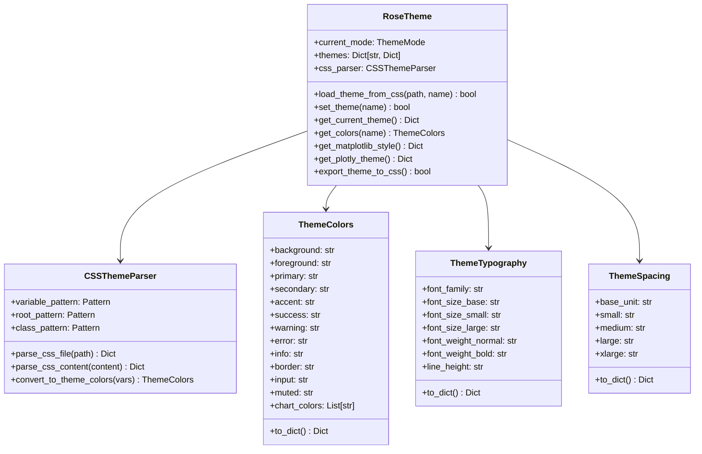
```mermaid
classDiagram
    class RoseTheme {
        +current_mode: ThemeMode
        +themes: Dict[str, Dict]
        +css_parser: CSSThemeParser
        +load_theme_from_css(path, name) bool
        +set_theme(name) bool
        +get_current_theme() Dict
        +get_colors(name) ThemeColors
        +get_matplotlib_style() Dict
        +get_plotly_theme() Dict
        +export_theme_to_css() bool
    }
    
    class CSSThemeParser {
        +variable_pattern: Pattern
        +root_pattern: Pattern
        +class_pattern: Pattern
        +parse_css_file(path) Dict
        +parse_css_content(content) Dict
        +convert_to_theme_colors(vars) ThemeColors
    }
    
    class ThemeColors {
        +background: str
        +foreground: str
        +primary: str
        +secondary: str
        +accent: str
        +success: str
        +warning: str
        +error: str
        +info: str
        +border: str
        +input: str
        +muted: str
        +chart_colors: List[str]
        +to_dict() Dict
    }
    
    class ThemeTypography {
        +font_family: str
        +font_size_base: str
        +font_size_small: str
        +font_size_large: str
        +font_weight_normal: str
        +font_weight_bold: str
        +line_height: str
        +to_dict() Dict
    }
    
    class ThemeSpacing {
        +base_unit: str
        +small: str
        +medium: str
        +large: str
        +xlarge: str
        +to_dict() Dict
    }
    
    RoseTheme --> CSSThemeParser
    RoseTheme --> ThemeColors
    RoseTheme --> ThemeTypography
    RoseTheme --> ThemeSpacing
```

## Data Flow Architecture

### Complete Data Flow Diagram

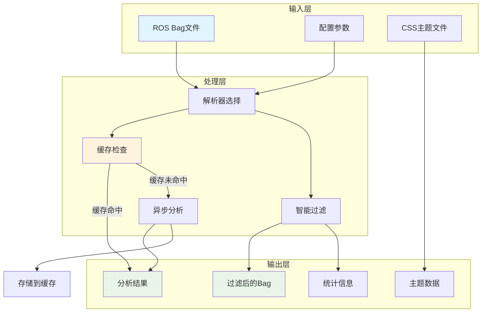
```mermaid
flowchart TD
    subgraph "输入层"
        BAG[ROS Bag文件]
        CONFIG[配置参数]
        CSS[CSS主题文件]
    end
    
    subgraph "处理层"
        PARSE[解析器选择]
        ANALYZE[异步分析]
        FILTER[智能过滤]
        CACHE_CHECK[缓存检查]
    end
    
    subgraph "输出层"
        RESULT[分析结果]
        FILTERED_BAG[过滤后的Bag]
        STATS[统计信息]
        THEME_DATA[主题数据]
    end
    
    BAG --> PARSE
    CONFIG --> PARSE
    CSS --> THEME_DATA
    
    PARSE --> CACHE_CHECK
    CACHE_CHECK -->|缓存命中| RESULT
    CACHE_CHECK -->|缓存未命中| ANALYZE
    
    ANALYZE --> RESULT
    ANALYZE --> CACHE_STORE[存储到缓存]
    
    PARSE --> FILTER
    FILTER --> FILTERED_BAG
    FILTER --> STATS
    
    style BAG fill:#e1f5fe
    style RESULT fill:#e8f5e8
    style FILTERED_BAG fill:#e8f5e8
    style CACHE_CHECK fill:#fff3e0
```

### Cache Strategy Flow

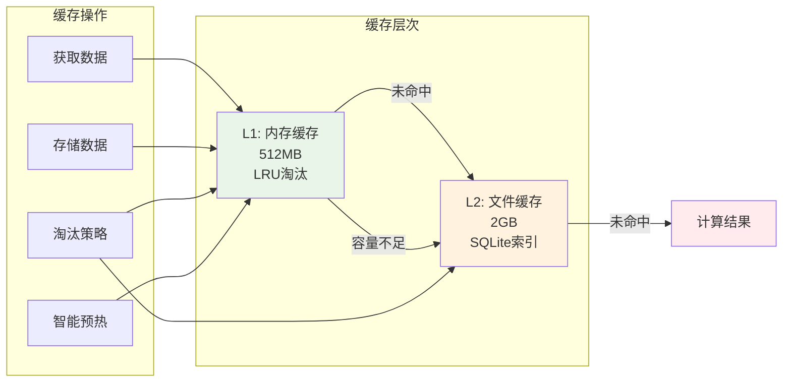
```mermaid
flowchart LR
    subgraph "缓存层次"
        L1[L1: 内存缓存<br/>512MB<br/>LRU淘汰]
        L2[L2: 文件缓存<br/>2GB<br/>SQLite索引]
    end
    
    subgraph "缓存操作"
        GET[获取数据]
        PUT[存储数据]
        EVICT[淘汰策略]
        PREHEAT[智能预热]
    end
    
    GET --> L1
    L1 -->|未命中| L2
    L2 -->|未命中| COMPUTE[计算结果]
    
    PUT --> L1
    L1 -->|容量不足| L2
    
    EVICT --> L1
    EVICT --> L2
    
    PREHEAT --> L1
    
    style L1 fill:#e8f5e8
    style L2 fill:#fff3e0
    style COMPUTE fill:#ffebee
```

## Performance Optimization Design

### Asynchronous Processing Architecture

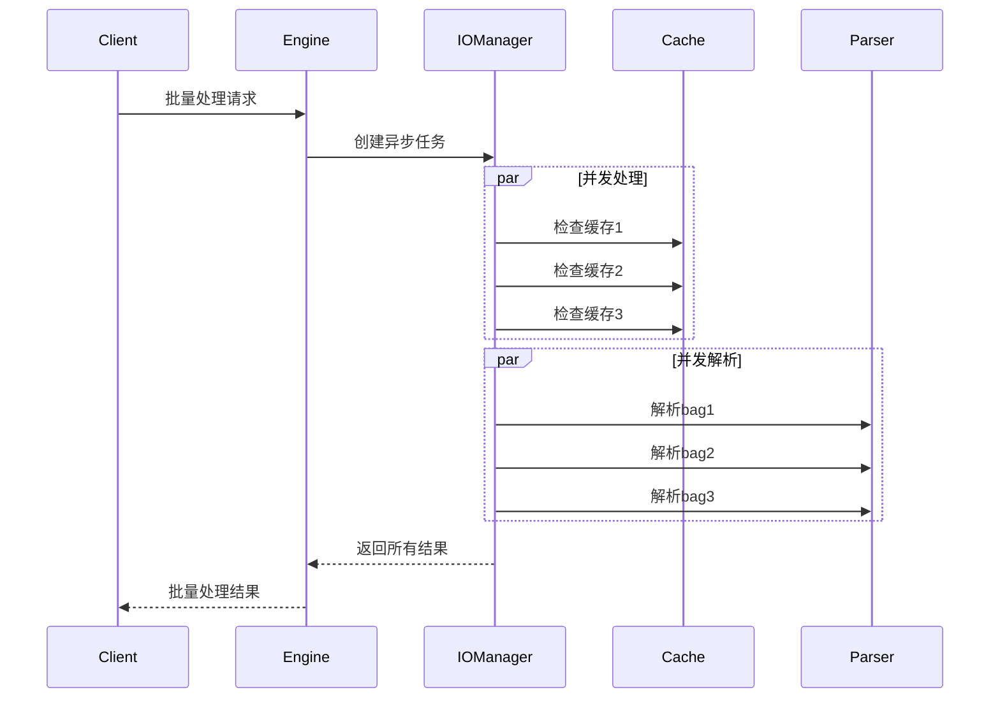
```mermaid
sequenceDiagram
    participant Client
    participant Engine
    participant IOManager
    participant Cache
    participant Parser
    
    Client->>Engine: 批量处理请求
    Engine->>IOManager: 创建异步任务
    
    par 并发处理
        IOManager->>Cache: 检查缓存1
        IOManager->>Cache: 检查缓存2
        IOManager->>Cache: 检查缓存3
    end
    
    par 并发解析
        IOManager->>Parser: 解析bag1
        IOManager->>Parser: 解析bag2
        IOManager->>Parser: 解析bag3
    end
    
    IOManager-->>Engine: 返回所有结果
    Engine-->>Client: 批量处理结果
```

### Intelligent Cache Preheating

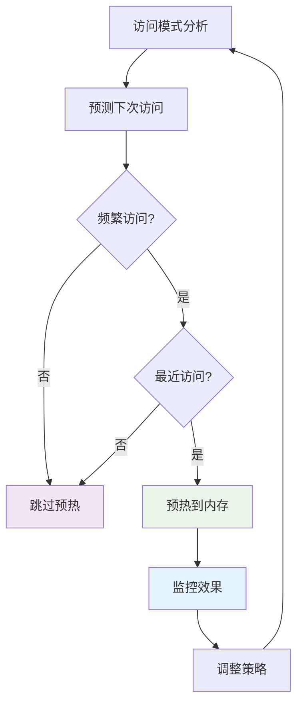
```mermaid
flowchart TD
    ACCESS[访问模式分析] --> PREDICT[预测下次访问]
    PREDICT --> FREQUENT{频繁访问?}
    FREQUENT -->|是| RECENT{最近访问?}
    FREQUENT -->|否| SKIP[跳过预热]
    
    RECENT -->|是| PREHEAT[预热到内存]
    RECENT -->|否| SKIP
    
    PREHEAT --> MONITOR[监控效果]
    MONITOR --> ADJUST[调整策略]
    ADJUST --> ACCESS
    
    style PREHEAT fill:#e8f5e8
    style MONITOR fill:#e3f2fd
    style SKIP fill:#f3e5f5
```

## Error Handling and Degradation Strategy

### Parser Degradation Flow

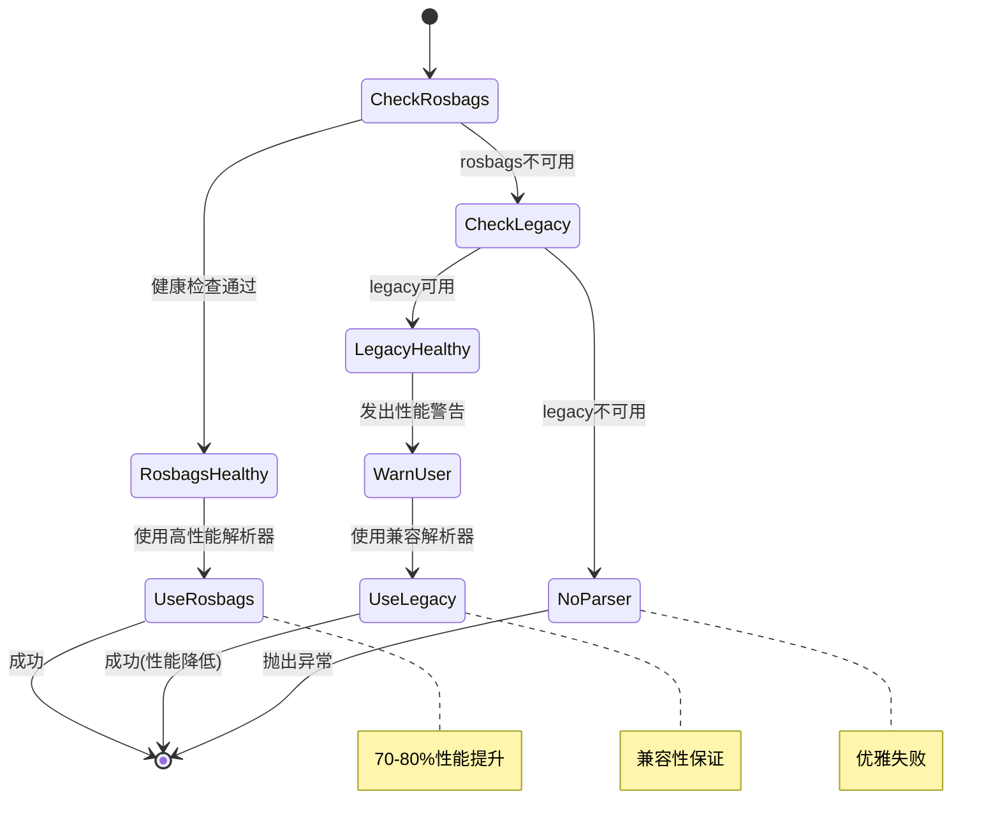
```mermaid
stateDiagram-v2
    [*] --> CheckRosbags
    CheckRosbags --> RosbagsHealthy: 健康检查通过
    CheckRosbags --> CheckLegacy: rosbags不可用
    
    RosbagsHealthy --> UseRosbags: 使用高性能解析器
    UseRosbags --> [*]: 成功
    
    CheckLegacy --> LegacyHealthy: legacy可用
    CheckLegacy --> NoParser: legacy不可用
    
    LegacyHealthy --> WarnUser: 发出性能警告
    WarnUser --> UseLegacy: 使用兼容解析器
    UseLegacy --> [*]: 成功(性能降低)
    
    NoParser --> [*]: 抛出异常
    
    note right of UseRosbags: 70-80%性能提升
    note right of UseLegacy: 兼容性保证
    note right of NoParser: 优雅失败
```

### Cache Degradation Strategy

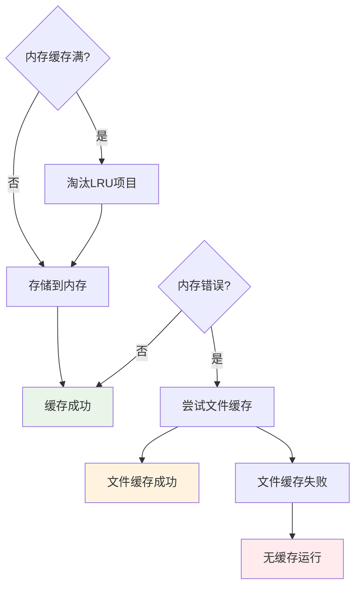
```mermaid
flowchart TD
    MEMORY_FULL{内存缓存满?} -->|是| EVICT_LRU[淘汰LRU项目]
    MEMORY_FULL -->|否| STORE_MEMORY[存储到内存]
    
    EVICT_LRU --> STORE_MEMORY
    STORE_MEMORY --> SUCCESS[缓存成功]
    
    MEMORY_ERROR{内存错误?} -->|是| TRY_FILE[尝试文件缓存]
    MEMORY_ERROR -->|否| SUCCESS
    
    TRY_FILE --> FILE_SUCCESS[文件缓存成功]
    TRY_FILE --> FILE_FAIL[文件缓存失败]
    
    FILE_FAIL --> NO_CACHE[无缓存运行]
    
    style SUCCESS fill:#e8f5e8
    style FILE_SUCCESS fill:#fff3e0
    style NO_CACHE fill:#ffebee
```

## Extensibility Design

### Plugin Architecture

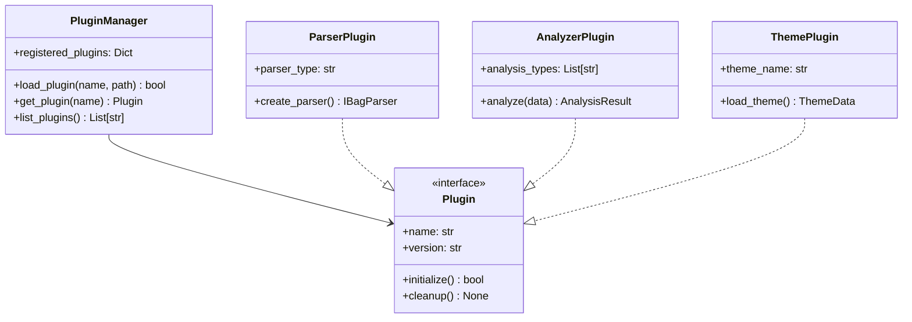
```mermaid
classDiagram
    class PluginManager {
        +registered_plugins: Dict
        +load_plugin(name, path) bool
        +get_plugin(name) Plugin
        +list_plugins() List[str]
    }
    
    class Plugin {
        <<interface>>
        +name: str
        +version: str
        +initialize() bool
        +cleanup() None
    }
    
    class ParserPlugin {
        +parser_type: str
        +create_parser() IBagParser
    }
    
    class AnalyzerPlugin {
        +analysis_types: List[str]
        +analyze(data) AnalysisResult
    }
    
    class ThemePlugin {
        +theme_name: str
        +load_theme() ThemeData
    }
    
    PluginManager --> Plugin
    ParserPlugin ..|> Plugin
    AnalyzerPlugin ..|> Plugin
    ThemePlugin ..|> Plugin
```

### Configuration-Driven Architecture

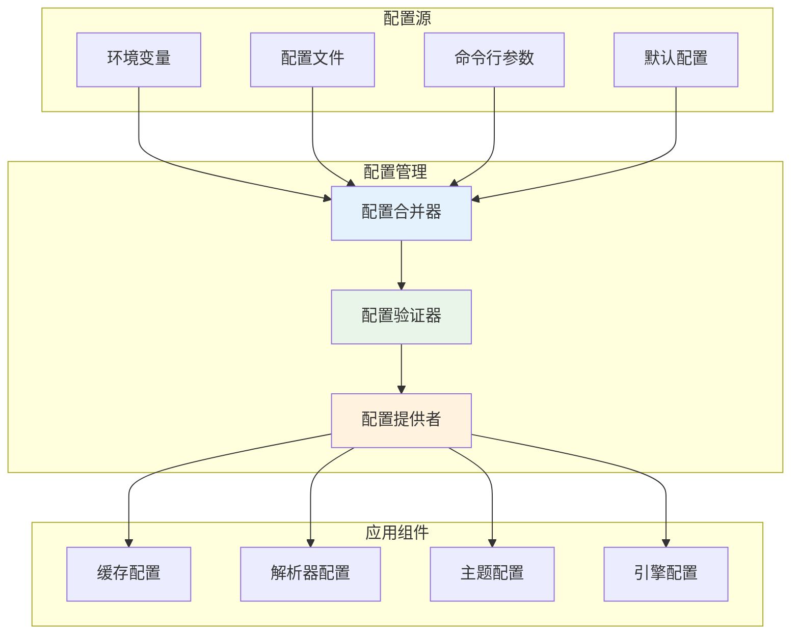
```mermaid
flowchart TD
    subgraph "配置源"
        ENV[环境变量]
        FILE[配置文件]
        ARGS[命令行参数]
        DEFAULT[默认配置]
    end
    
    subgraph "配置管理"
        MERGER[配置合并器]
        VALIDATOR[配置验证器]
        PROVIDER[配置提供者]
    end
    
    subgraph "应用组件"
        CACHE_CONFIG[缓存配置]
        PARSER_CONFIG[解析器配置]
        THEME_CONFIG[主题配置]
        ENGINE_CONFIG[引擎配置]
    end
    
    ENV --> MERGER
    FILE --> MERGER
    ARGS --> MERGER
    DEFAULT --> MERGER
    
    MERGER --> VALIDATOR
    VALIDATOR --> PROVIDER
    
    PROVIDER --> CACHE_CONFIG
    PROVIDER --> PARSER_CONFIG
    PROVIDER --> THEME_CONFIG
    PROVIDER --> ENGINE_CONFIG
    
    style MERGER fill:#e3f2fd
    style VALIDATOR fill:#e8f5e8
    style PROVIDER fill:#fff3e0
```

## Deployment Architecture

### Multi-Environment Support

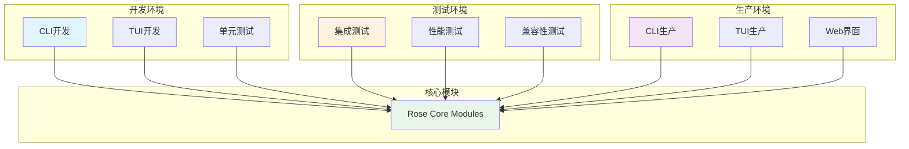
```mermaid
graph TB
    subgraph "开发环境"
        DEV_CLI[CLI开发]
        DEV_TUI[TUI开发]
        DEV_TEST[单元测试]
    end
    
    subgraph "测试环境"
        TEST_INT[集成测试]
        TEST_PERF[性能测试]
        TEST_COMPAT[兼容性测试]
    end
    
    subgraph "生产环境"
        PROD_CLI[CLI生产]
        PROD_TUI[TUI生产]
        PROD_WEB[Web界面]
    end
    
    subgraph "核心模块"
        CORE[Rose Core Modules]
    end
    
    DEV_CLI --> CORE
    DEV_TUI --> CORE
    DEV_TEST --> CORE
    
    TEST_INT --> CORE
    TEST_PERF --> CORE
    TEST_COMPAT --> CORE
    
    PROD_CLI --> CORE
    PROD_TUI --> CORE
    PROD_WEB --> CORE
    
    style CORE fill:#e8f5e8
    style DEV_CLI fill:#e1f5fe
    style TEST_INT fill:#fff3e0
    style PROD_CLI fill:#f3e5f5
```

## Summary

Rose's new architecture achieves the following design goals:

1. **Modularity**: 6 core modules with clear responsibilities and boundaries
2. **High Performance**: Intelligent caching, asynchronous processing, parser optimization
3. **High Availability**: Automatic degradation, error recovery, health checks
4. **Easy to Extend**: Plugin-based design, configuration-driven, unified interfaces
5. **Easy to Use**: Minimal imports, unified API, comprehensive documentation

The architecture design fully considers performance, maintainability, extensibility, and user experience, laying a solid foundation for Rose's long-term development. 