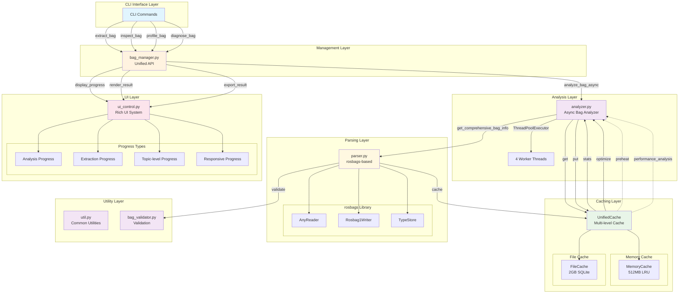
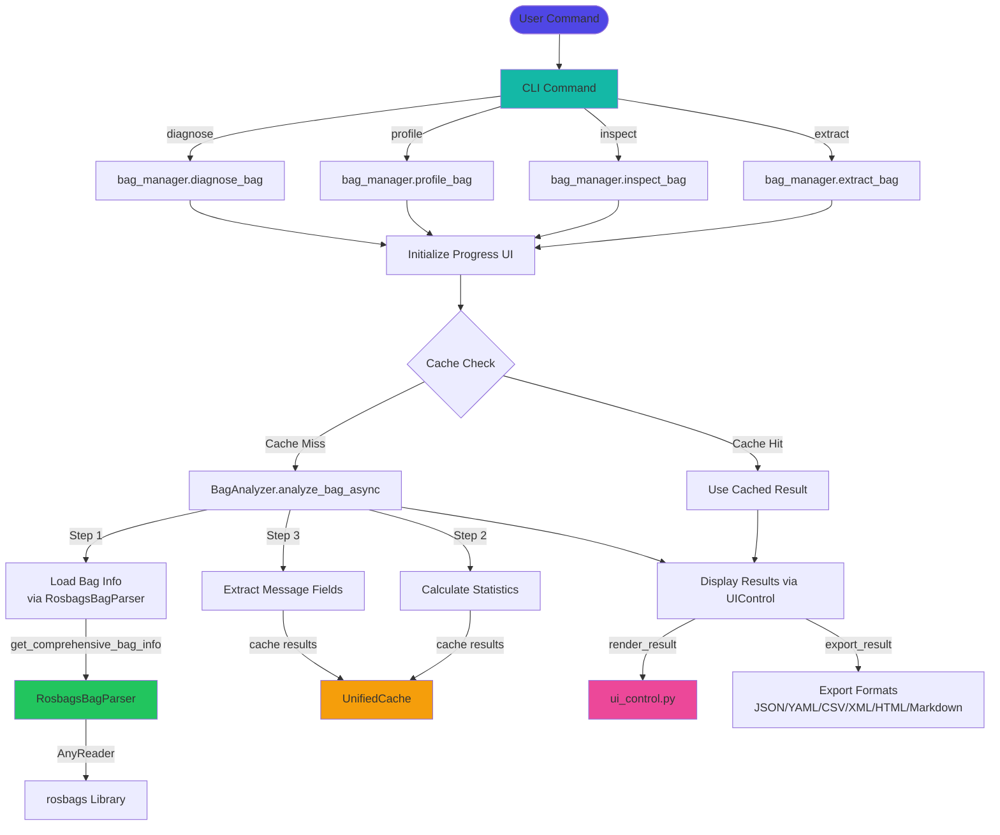
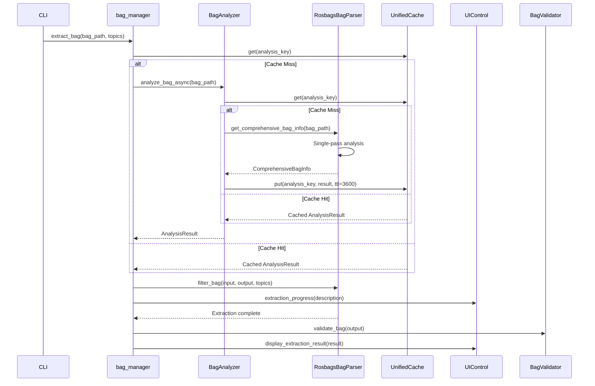

# Core Architecture Documentation

## Overview

The Rose core directory (`./roseApp/core`) implements a sophisticated ROS bag file processing system with a layered architecture. The system provides high-performance bag analysis, filtering, and extraction capabilities using modern Python libraries and intelligent caching mechanisms.

## Architecture Layers

The system follows a clear layered architecture pattern:

1. **CLI Interface Layer** - User interface and command handling
2. **Management Layer** - High-level bag operations coordination
3. **Analysis Layer** - Asynchronous bag analysis with caching
4. **Parsing Layer** - Low-level bag file processing using rosbags
5. **Caching Layer** - Multi-level caching for performance optimization
6. **UI Layer** - Rich progress displays and result formatting
7. **Utility Layer** - Common utilities and helper functions

## System Architecture Diagram



## Component Architecture

### 1. BagManager.py - Core Bag Management
- **Purpose**: Manages bag file lifecycle and topic operations
- **Key Classes**: `Bag`, `BagManager`
- **Responsibilities**: 
  - Load/unload bag files
  - Topic selection and filtering
  - Bag metadata management

### 2. bag_manager.py - Unified High-Level Interface
- **Purpose**: Provides async interface for complete bag operations
- **Key Methods**: 
  - `inspect_bag()` - Analyze bag contents
  - `extract_bag()` - Filter and extract topics
  - `profile_bag()` - Performance profiling
  - `diagnose_bag()` - Health diagnostics
- **Integration**: Coordinates between analyzer, parser, and UI

### 3. parser.py - ROS Bag Parser (rosbags-based)
- **Purpose**: High-performance bag parsing using rosbags library
- **Key Classes**: `RosbagsBagParser`, `ComprehensiveBagInfo`
- **Features**:
  - Memory-efficient chunked processing (10k messages/chunk)
  - Comprehensive caching (5min TTL)
  - Support for BZ2, LZ4, uncompressed formats
  - Single-pass statistics calculation

### 4. analyzer.py - Async Bag Analysis
- **Purpose**: Asynchronous bag analysis with intelligent caching
- **Key Classes**: `BagAnalyzer`, `AnalysisResult`
- **Features**:
  - ThreadPoolExecutor-based async operations
  - Message type structure analysis
  - Field extraction and analysis
  - Caching with 1-hour TTL

### 5. cache.py - Multi-Level Caching System
- **Purpose**: Unified caching with memory + file persistence
- **Key Classes**: `UnifiedCache`, `MemoryCache`, `FileCache`
- **Specifications**:
  - Memory Cache: 512MB LRU with TTL support
  - File Cache: 2GB SQLite-backed with compression
  - Performance analysis and optimization

### 6. ui_control.py - Rich UI System
- **Purpose**: Comprehensive UI management with progress bars and theming
- **Key Features**:
  - 4 types of progress bars (analysis, extraction, topic-level, responsive)
  - Theme system (light/dark/auto modes)
  - Export capabilities (JSON, YAML, CSV, XML, HTML, Markdown)
  - Rich formatting and display

### 7. util.py - Common Utilities
- **Purpose**: Shared utilities and helper functions
- **Key Features**:
  - Logging configuration
  - Time conversion utilities
  - Compression validation
  - Platform compatibility

## Data Flow Architecture



## Calling Relationships

### Primary Call Chain
1. **CLI → bag_manager.py**: User commands initiate operations
2. **bag_manager.py → analyzer.py**: Request async analysis with caching
3. **analyzer.py → parser.py**: Parse bag file using rosbags
4. **analyzer.py → cache.py**: Store/fetch analysis results
5. **bag_manager.py → ui_control.py**: Display progress and results

### Detailed Call Flow

#### Bag Inspection Flow
```
CLI.inspect_bag() → bag_manager.inspect_bag() 
                → BagAnalyzer.analyze_bag_async() 
                → RosbagsBagParser.get_comprehensive_bag_info()
                → UnifiedCache.get() / UnifiedCache.put()
                → UIControl.display_inspection_result()
```

#### Bag Extraction Flow
```
CLI.extract_topics() → bag_manager.extract_bag()
                   → BagAnalyzer.analyze_bag_async() [optional]
                   → RosbagsBagParser.filter_bag()
                   → UIControl.extraction_progress()
                   → BagValidator.validate_bag()
```

#### Caching Flow
```
Any Component → UnifiedCache.get(key)
             → MemoryCache.get() [512MB LRU]
             → FileCache.get() [2GB SQLite] 
             → Performance analysis and optimization
```

## Component Interaction Sequence



## Performance Optimizations

### Memory Management
- **Chunked Processing**: 10,000 messages per chunk to prevent memory overflow
- **Memory Limits**: 64MB per chunk, 512MB memory cache
- **Streaming Processing**: Process messages in streaming fashion

### Caching Strategy
- **Multi-Level Cache**: Memory (fast) + File (persistent)
- **Smart TTL**: 5min for bag info, 1hr for analysis results
- **Cache Warming**: Preheat based on access patterns
- **Eviction Policy**: LRU with size-based eviction

### Async Processing
- **ThreadPoolExecutor**: 4 worker threads for parallel operations
- **Non-blocking I/O**: All file operations use async patterns
- **Progress Callbacks**: Real-time progress updates

## Error Handling

### Validation Layer
- **Bag Health Checks**: Validate extracted files
- **Format Validation**: Ensure rosbags compatibility
- **Compression Checks**: Validate BZ2/LZ4 availability

### Error Recovery
- **Graceful Degradation**: Fallback to uncached processing
- **Partial Results**: Return available data on errors
- **Comprehensive Logging**: Detailed error tracking and reporting

## Integration Points

### External Dependencies
- **rosbags**: High-performance ROS bag processing
- **rich**: Terminal UI and progress bars
- **asyncio**: Async processing framework
- **SQLite**: File-based caching

### Compatibility
- **ROS1**: Full compatibility with ROS1 bag formats
- **Python 3.8+**: Modern Python features
- **Cross-Platform**: Windows, macOS, Linux support

## Configuration

### Cache Settings
- Memory Cache: 512MB (configurable)
- File Cache: 2GB (configurable)
- Cache Directory: System temp + `rose_cache`

### Processing Settings
- Thread Count: 4 workers (configurable)
- Chunk Size: 10,000 messages (configurable)
- Memory Limit: 64MB per chunk (configurable)

This architecture provides a robust, scalable foundation for ROS bag file processing with excellent performance characteristics and user experience.