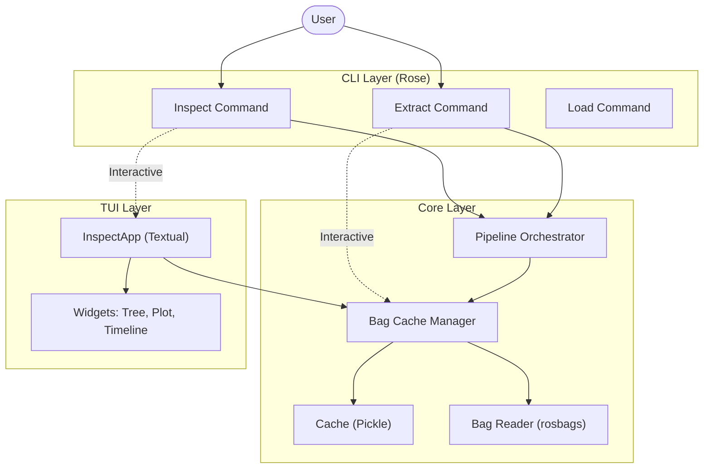

# Software Architecture

Rose is designed with a layered architecture focusing on modularity, performance, and aesthetic consistency.

## Overview

The system is divided into three main layers:
1.  **Core Layer**: Handles data processing, caching, and ROS bag interaction.
2.  **CLI Layer**: Provides command-line interface and terminal output styling.
3.  **TUI Layer**: Offers interactive visual inspection using Textual.

## System Diagram

## Component Details

### Core Layer

*   **Pipeline Pattern**: All heavy operations (loading, analysis, extraction) are implemented as generator-based pipelines in `roseApp.core.pipeline`. This allows the CLI and TUI to consume events (`LogEvent`, `ProgressEvent`) and render progress in real-time without blocking.
*   **Unified Cache**: To improve performance, bag analysis results (structure, message counts, types) are cached using `roseApp.core.cache`. The cache uses file hashing to ensure validity.
*   **Bag Abstraction**: Rose uses `rosbags` high-level `AnyReader` to support both legacy ROS1 (`.bag`) and ROS2 (`.mcap`) formats without requiring a full ROS environment.

### CLI Layer

*   **Typer & Rich**: Built with `Typer` for argument parsing and `Rich` for beautiful terminal output.
*   **Theme System**: Integrating a "Cassette Futurism" aesthetic, the `Output` class (`roseApp.core.output`) manages consistent coloring and formatting across all commands.

### TUI Layer

*   **Textual Framework**: The interactive inspector is a full TUI application using Textual.
*   **Async Event Handling**: TUI components update asynchronously based on user input and background data loading.
*   **Plotting**: Integration with `plotext` allows for real-time data visualization directly in the terminal.
