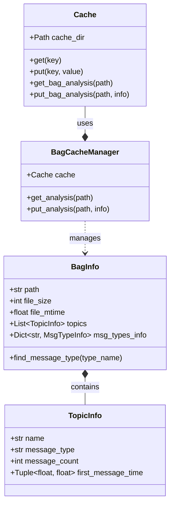
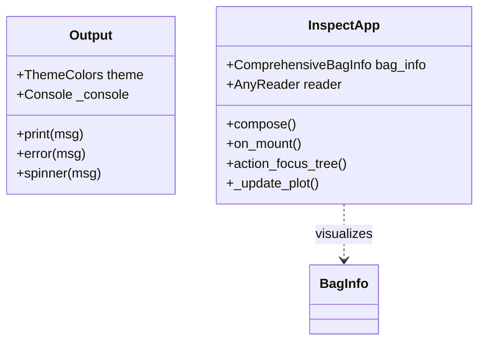
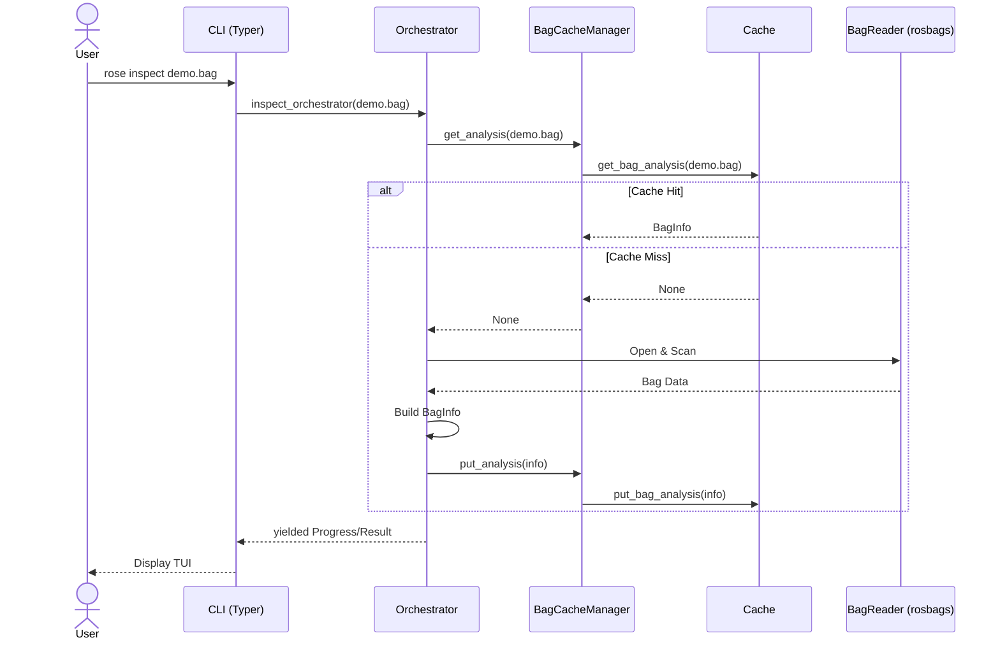
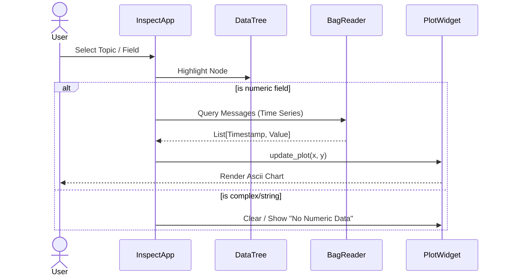

# Detailed Design

This document covers the low-level design of the Rose application, including class structures and sequence diagrams for key workflows.

## Class Design

### Data Models & Cache

Core data models reside in `roseApp.core.model` and form the backbone of the caching system.

### CLI & Visualization

The CLI uses the `Output` wrapper for consistent theming, while `InspectApp` manages the Textual TUI state.

## Workflows

### 1. Load / Analysis Workflow

When a user runs `rose load` or `rose inspect`, the system ensures metadata is available.

### 2. TUI Data Inspection

Interactive data exploration inside `InspectApp`.

