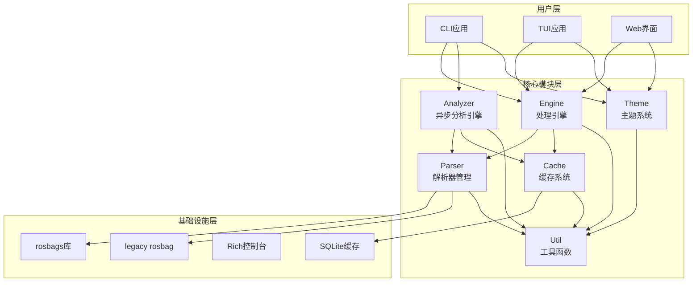

# Rose 核心模块文档索引

本目录包含Rose核心模块的详细使用文档。每个模块都有独立的文档，提供完整的API说明和使用示例。

## 📚 模块文档列表

### [🔍 Analyzer 模块](ANALYZER.md)
**异步分析引擎** - 提供高性能的ROS bag文件分析功能
- 异步分析处理，支持进度回调
- 智能缓存，避免重复计算
- 消息类型分析和字段信息提取
- 多种分析类型支持

### [📦 Cache 模块](CACHE.md) 
**统一缓存系统** - 多级缓存架构，智能性能优化
- 内存缓存 + 文件缓存分层设计
- 智能预热和自动优化
- 详细的性能统计分析
- TTL支持和线程安全

### [⚙️ Engine 模块](ENGINE.md)
**核心处理引擎** - 异步bag文件处理和操作
- 异步I/O操作，高性能处理
- 批量处理，支持多文件并发
- 智能过滤和压缩支持
- 进度回调和错误恢复

### [📄 Parser 模块](PARSER.md)
**智能解析器管理** - 自动选择最优解析器
- 智能选择rosbags或legacy解析器
- 健康检查和自动降级机制
- 70%+性能提升的rosbags支持
- 统一接口，屏蔽实现差异

### [🎨 Theme 模块](THEME.md)
**主题系统** - 统一的视觉体验管理
- CSS主题解析和变量支持
- 动态主题切换
- 多平台适配(CLI/TUI/Web)
- 预设主题和自定义扩展

### [🛠️ Util 模块](UTIL.md)
**工具函数集合** - 基础功能支持
- ROS时间转换工具
- 结构化日志系统
- 性能监控和测量
- 应用模式管理
- 文件操作和压缩支持

## 🚀 快速开始

### 基础使用模式

```python
# 异步分析bag文件
from roseApp.core.analyzer import analyze_bag_async, AnalysisType

result = await analyze_bag_async("example.bag", AnalysisType.METADATA)
print(f"发现 {len(result.bag_info.topics)} 个话题")

# 过滤bag文件
from roseApp.core.engine import filter_bag_async

result = await filter_bag_async(
    input_path="input.bag",
    topics=["/camera/image", "/lidar/points"],
    compression="bz2"
)
```

### CLI应用集成

```python
# CLI应用的典型集成模式
from roseApp.core.util import set_app_mode, AppMode, get_logger
from roseApp.core.theme import get_current_colors
from roseApp.core.cache import get_cache_stats

# 设置应用模式
set_app_mode(AppMode.CLI)

# 获取日志器
logger = get_logger("my_cli")

# 获取主题颜色
colors = get_current_colors()

# 检查缓存状态
cache_stats = get_cache_stats()
logger.info(f"缓存命中率: {cache_stats.get('unified', {}).get('hit_rate', 0):.1%}")
```

## 📋 模块关系图



## 🎯 使用建议

### 1. 模块选择指南

- **只需分析bag文件** → 使用 `Analyzer` 模块
- **需要处理/过滤bag文件** → 使用 `Engine` 模块  
- **需要缓存功能** → `Cache` 模块自动集成
- **需要解析bag文件** → `Parser` 模块自动选择最优解析器
- **需要UI主题** → 使用 `Theme` 模块
- **需要工具函数** → 使用 `Util` 模块

### 2. 性能优化建议

- 优先使用异步接口(`*_async`函数)
- 利用缓存系统避免重复计算
- 合理设置分析类型(`METADATA` vs `FULL_ANALYSIS`)
- 使用批量处理接口处理多个文件

### 3. 错误处理建议

- 检查函数返回值中的`errors`字段
- 使用`try-except`捕获异常
- 查看日志获取详细错误信息
- 利用解析器自动降级机制

## 📖 更多资源

- [架构设计文档](../ARCHITECTURE_DESIGN.md) - 详细的系统架构说明
- [核心API指南](../CORE_API_GUIDE.md) - API使用总览
- [示例代码](../../examples/) - 实际使用示例

## 🤝 贡献指南

如果您发现文档问题或有改进建议：

1. 查看对应模块的源代码了解最新API
2. 运行示例代码验证功能
3. 提交Issue或Pull Request
4. 遵循现有的文档格式和风格

---

**注意**: 所有核心模块都支持异步操作，推荐在异步环境中使用以获得最佳性能。 